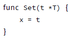

# 进阶

Go 有指针。然而却没有指针运算，因此它们更象是引用而不是你所知道的来自于 C的指针。指针非常有用。在 Go 中调用函数的时候，得记得变量是值传递的。因此，为了修改一个传递入函数的值的效率和可能性，有了指针。

通过类型作为前缀来定义一个指针 ’*’：var p *int。现在 p 是一个指向整数值的指针。所有新定义的变量都被赋值为其类型的零值，而指针也一样。一个新定义的或者没有任何指向的指针，有值 nil。在其他语言中，这经常被叫做空（NULL）指针，在 Go 中就是 nil。让指针指向某些内容，可以使用取址操（&），像这样：


从指针获取值是通过在指针变量前置 ’*’ 实现的：


前面已经说了，没有指针运算，所以如果这样写：*p++，它表示 (*p)++：首先获取指针指向的值，然后对这个值加一。

## 内存分配

Go 同样也垃圾收集，也就是说无须担心内存分配和回收。

Go 有两个内存分配原语，new 和 make。它们应用于不同的类型，做不同的工作，可能有些迷惑人，但是规则很简单。下面的章节展示了在 Go 中如何处理内存分配，并且希望能够让 new 和 make 之间的区别更加清晰。

### 用 new 分配内存

内建函数 new 本质上说跟其他语言中的同名函数功能一样：new(T) 分配了零值填充的 T 类型的内存空间，并且返回其地址，一个 *T 类型的值。用 Go 的术语说，它返回了一个指针，指向新分配的类型 T 的零值。记住这点非常重要。

这意味着使用者可以用 new 创建一个数据结构的实例并且可以直接工作。如 bytes.Buffer 的文档所述 “Buffer 的零值是一个准备好了的空缓冲。” 类似的，sync.Mutex 也没有明确的构造函数或 Init 方法。取而代之， sync.Mutex 的零值被定义为非锁定的互斥量。

零值是非常有用的。例如这样的类型定义，57 页的”定义自己的类型” 内容。


SyncedBuffer 的值在分配内存或定义之后立刻就可以使用。在这个片段中，p 和 v 都可以在没有任何更进一步处理的情况下工作。


### 用 make 分配内存

回到内存分配。内建函数 make(T, args) 与 new(T) 有着不同的功能。它只能创建 slice，map 和 channel，并且返回一个有初始值（非零）的 T 类型，而不是 *T。本质来讲，导致这三个类型有所不同的原因是指向数据结构的引用在使用前必须被初始化。

例如，一个 slice，是一个包含指向数据（内部 array）的指针，长度和容量的三项描述符；在这些项目被初始化之前，slice 为 nil。对于 slice，map 和 channel，make 初始化了内部的数据结构，填充适当的值。

例如，make([]int, 10, 100) 分配了 100 个整数的数组，然后用长度 10 和容量 100创建了 slice 结构指向数组的前 10 个元素。区别是，new([]int) 返回指向新分配的内存的指针，而零值填充的 slice 结构是指向 nil 的 slice 值。

这个例子展示了 new 和 make 的不同。


务必记得 make 仅适用于 map，slice 和 channel，并且返回的不是指针。应当用 new 获得特定的指针。

>new 分配；make 初始化

>上面的两段可以简单总结为：

>- new(T) 返回 *T 指向一个零值 T  
>- make(T) 返回初始化后的 T
  
>当然 make 仅适用于slice，map 和channel。

### 构造函数与复合声明

有时零值不能满足需求，必须要有一个用于初始化的构造函数，例如这个来自 os 包的例子。


有许多冗长的内容。可以使用复合声明使其更加简洁，每次只用一个表达式创建一个新的实例。


返回本地变量的地址没有问题；在函数返回后，相关的存储区域仍然存在。

事实上，从复合声明获取分配的实例的地址更好，因此可以最终将两行缩短到一行。

```
return &File{fd, name, nil, 0}
```

The items (called of a composite +literal are laid out in order and must all be 所有的项目（称作字段）都必须按顺序全部写上。然而，通过对元素用字段: 值成对的标识，初始化内容可以按任意顺序出现，并且可以省略初始化为零值的字段。因此可以这样

```
return &File{fd: fd, name: name}
```

在特定的情况下，如果复合声明不包含任何字段，它创建特定类型的零值。表达式 new(File) 和 &File{} 是等价的。

复合声明同样可以用于创建 array，slice 和 map，通过指定适当的索引和 map 键来标识字段。在这个例子中，无论是 Enone，Eio 还是 Einval 初始化都能很好的工作，只要确保它们不同就好了。


## 定义自己的类型

自然，Go 允许定义新的类型，通过关键字type 实现：

```
type foo i n t
```

创建了一个新的类型 foo 作用跟 int 一样。创建更加复杂的类型需要用到 struct 关键字。这有个在一个数据结构中记录某人的姓名（string）和年龄（int），并且使其成为一个新的类型的例子：


通常，fmt.Printf("%v\n", a) 的输出是

```
&{Pete 42}
```

这很棒！Go 知道如何打印结构。如果仅想打印某一个，或者某几个结构中的字段，需要使用 .<field name>。例如，仅仅打印名字：


### 结构字段

之前已经提到结构中的项目被称为 field。没有字段的结构：struct {} 或者有四个 c 字段的：


如果省略字段的名字，可以创建匿名字段，例如：


注意首字母大写的字段可以被导出，也就是说，在其他包中可以进行读写。字段名以小写字母开头是当前包的私有的。包的函数定义是类似的，参阅第 3 章了解更多细节。

### 方法

可以对新定义的类型创建函数以便操作，可以通过两种途径：

1. 创建一个函数接受这个类型的参数。

```
func doSomething(n1 *NameAge, n2 i n t ) { /* */ }
```

（你可能已经猜到了）这是函数调用。

2 .创建一个工作在这个类型上的函数（参阅在2.1 中定义的接收方）：

```
func (n1 *NameAge) doSomething(n2 i n t ) { /* */ }
```

这是方法调用，可以类似这样使用：

```
var n *NameAge
n.doSomething(2)
```

使用函数还是方法是由程序员决定的，但是如果想要满足接口（参阅下一章）就只能使用方法。如果没有这方面的需求，那就由个人品味决定了。

使用函数还是方法完全是由程序员说了算，但是若需要满足接口（参看下一章）就必须使用方法。如果没有这样的需求，那就完全由习惯来决定是使用函数还是方法了。

但是下面的内容一定要留意，引用自 [10]：

如果 x 可获取地址，并且 &x 的方法中包含了 m，x.m() 是 (&x).m() 更短的写法。

根据上面所述，这意味着下面的情况不是错误：


这里 Go 会查找 NameAge 类型的变量n 的方法列表，没有找到就会再查找 *NameAge 类型的方法列表，并且将其转化为 (&n).doSomething(2)。

下面的类型定义中有一些微小但是很重要的不同之处。同时可以参阅 [10, section “Type Declarations”]。假设有：

// Mutex 数据类型有两个方法，Lock 和 Unlock。


现在用两种不同的风格创建了两个数据类型。

- type NewMutex Mutex;  
- type PrintableMutex struct {Mutex }.

现在 NewMutux 等同于 Mutex，但是它没有任何 Mutex 的方法。换句话说，它的方法是空的。

但是 PrintableMutex 已经从 Mutex 继承了方法集合。如同 [10] 所说：

*PrintableMutex 的方法集合包含了 Lock 和 Unlock 方法，被绑定到其匿名字段 Mutex。

## 转换

有时需要将一个类型转换为另一个类型。在 Go 中可以做到，不过有一些规则。首先，将一个值转换为另一个是由操作符（看起来像函数：byte()）完成的，并且不是所有的转换都是允许的。

Table 4.1. 合法的转换，float64 同 float32 类似。注意，为了适配表格的显示，float32被简写为 flt32。


- 从 string 到字节或者 ruin 的 slice。  

```
mystring := "hello this is string"  
byteslice := []byte(mystring)
```

转换到 byte slice，每个 byte 保存字符串对应字节的整数值。注意 Go 的字符串是 UTF-8 编码的，一些字符可能是 1、2、3 或者 4 个字节结尾。

```
runeslice := []rune(mystring)
```

转换到 rune slice，每个 rune 保存 Unicode 编码的指针。字符串中的每个字符对应一个整数。

- 从字节或者整形的 slice 到 string。

```
b := []byte {'h','e','l','l','o'} // 复合声明
s := s t r i n g (b)
i := []rune {257,1024,65}
r := s t r i n g (i)
```

对于数值，定义了下面的转换：

- 将整数转换到指定的（bit）长度：uint8(int)；
- 从浮点数到整数：int(float32)。这会截断浮点数的小数部分；
- 其他的类似：float32(int)。

### 用户定义类型的转换

如何在自定义类型之间进行转换？这里创建了两个类型 Foo 和 Bar，而 Bar 是 Foo 的一个别名：


然后：


最后一行会引起错误：

cannot use b (type bar) as type foo in assignment(不能使用 b（类型 bar）作为类型 foo 赋值)

这可以通过转换来修复：

```
var f foo = foo(b)
```

注意转换那些字段不一致的结构是相当困难的。同时注意，转换 b 到 int 同样会出错；整数与有整数字段的结构并不一样。

## 组合

TODO(miek):work in progress Go 不是面向对象语言，因此并没有继承。但是有时又会需要从已经实现的类型中“继承”并修改一些方法。在Go 中可以用嵌入一个类型的方式来实现。

## 练习

**Q17**. (1) 指针运算

1. 在正文的第 54 页有这样的文字：

…这里没有指针运算，因此如果这样写：*p++，它被解释为(*p)++：  
首先解析引用然后增加值。

当像这样增加一个值的时候，什么类型可以工作？

2 .为什么它不能工作在所有类型上？

**Q18**. (2) 使用 interface 的 map 函数

1. 使用练习 Q11 的答案，利用 interface 使其更加通用。让它至少能同时工作于 int 和 string。

**Q19**. (1) 指针

1. 假设定义了下面的结构：


下面两行之间的区别是什么？

```
var p1 Person
p2 := new(Person)
```

2 .下面两个内存分配的区别是什么？



和


**Q20**. (1) Linked List

1 .Make use of the package container/list to create a (doubly) linked list. Push the
values 1, 2 and 4 to the list and then print it.

2 .Create your own linked list implementation. And perform the same actions as in
question 1

**Q21**. (1) Cat

1. 编写一个程序，模仿 Unix 的 cat 程序。对于不知道这个程序的人来说，下面的调用显示了文件 blah 的内容：% cat blah
2. 使其支持 n 开关，用于输出每行的行号。
3. 上面问题中，1 提供的解决方案存在一个 Bug。你能定位并修复它吗？

**Q22**. (2) 方法调用

1. 假设有下面的程序。要注意的是包 container/vector 曾经是 Go 的一部分，但是当内建的 append 出现后，就被移除了。然而，对于当前的问题这不重要。这个包实现了有 push 和 pop 方法的栈结构。


k1，k2 和 k3 的类型是什么？

2. 当前，这个程序可以编译并且运行良好。在不同类型的变量上 Push 都可以工作。Push 的文档这样描述：

func (p *IntVector) Push(x int) Push 增加 x 到向量的末尾。

那么接受者应当是 *IntVector 类型，为什么上面的代码（Push 语句）可以正确工作？above (the Push statements) work correct then?

## 答案

**A17**. (1) 指针运算

1. 这仅能工作于指向数字（int, uint 等等）的指针值。
2. ++ 仅仅定义在数字类型上，同时由于在 Go 中没有运算符重载，所以会在其他类型上失败（编译错误）。

**A18**. (2) 使用 interface 的 map 函数


**A19**. (1) 指针

1. 第一行：var p1 Person 分配了 Person-值给 p1。p1 的类型是 Person。  
第二行：p2 := new(Person) 分配了内存并且将指针赋值给 p2。p2 的类型是 *Person。
2. 在第二个函数中，x 指向一个新的（堆上分配的）变量 t，其包含了实际参数值的副本。

在第一个函数中，x 指向了 t 指向的内容，也就是实际上的参数指向的内容。

因此在第二个函数，我们有了“额外” 的变量存储了相关值的副本。

**A20**. (1) Linked List

1. The following is the implementation of a program using doubly linked lists from container/list.


0 .Include all the packages we need.  
1. Declare a type for the value our list will contain;  
2. declare a type for the each node in our list;  
3. Mimic the interface of container/list.  
4. When pushing, create a new Node with the provided value;  
5. if the list is empty, put the new node at the head;  
6. otherwise put it at the tail;  
7. make sure the new node points back to the previously existing one;  
8. point tail to the newly inserted node.  
9. When popping, return an error if the list is empty;  
10. otherwise save the last value;  
11. discard the last node from the list;  
12. and make sure the list is consistent if it becomes empty;  

**A21**. (1) Cat

1. 下面是 cat 的实现，同样支持 n 输出每行的行号。


0. 包含所有需要用到的包；
1. 定义新的开关 "n”，默认是关闭的。注意很容易写的帮助文本；
2. 实际上读取并且显示文件内容的函数；
3. 每次读一行；
4. 如果到达文件结尾；
5. 如果设定了行号，打印行号然后是内容本身；
6. 否则，仅仅打印该行内容。

2. 当最后一行不包括换行符时，这个 Bug 就会出现。更糟糕的情况是，当输入只有一行且没有换行符的时候，什么也不显示。下面的程序是一个更好的解决方案。


**A22**. (2) 方法调用

1. k1 的类型是 vector.IntVector。为什么？这里使用了符号 {}，因此获得了类型的值。变量 k2 是 *vector.IntVector，因为获得了复合语句的地址（&）。而最后的 k3 同样是 *vector.IntVector 类型，因为 new 返回该类型的指针。

2. 在 [10] 的“调用” 章节，有这样的描述：

当 x 的方法集合包含 m，并且参数列表可以赋值给 m 的参数，方法调用 x.m() 是合法的。如果 x 可以被地址化，而 &x 的方法集合包含 m，x.m() 可以作为 (&x).m() 的省略写法。

换句话说，由于 k1 可以被地址化，而 *vector.IntVector 具有 Push 方法，调用 k1.Push(2) 被 Go 转换为 (&k1).Push(2) 来使型系统愉悦（也使你愉悦——现在你已经了解到这一点）

