# 通讯

在这章中将介绍 Go 中与外部通讯的通讯模块。将会了解文件、目录、网络通讯和运行其他程序。Go 的 I/O 核心是接口 io.Reader 和 io.Writer。

在 Go 中，从文件读取（或写入）是非常容易的。程序只需要使用 os 包就可以从文件 /etc/passwd 中读取数据。

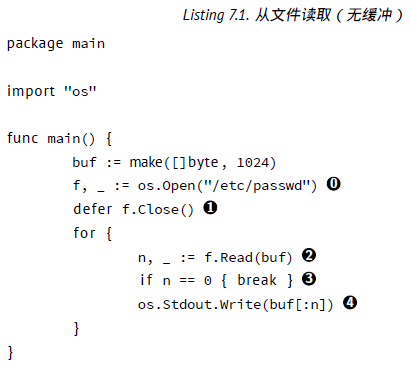

接下来展示了如何做到这点：

0. 打开文件，os.Open 返回一个实现了 io.Reader 和 io.Writer 的 *os.File；
1. 确保关闭了 f；
2. 一次读取 1024 字节；
3. 到达文件末尾；
4. 将内容写入 os.Stdout

如果想要使用缓冲 IO，则有 bufio 包：

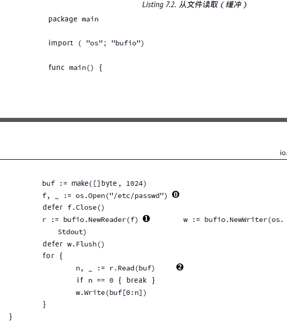

0 .打开文件；

1. 转换 f 为有缓冲的 Reader。NewReader 需要一个 io.Reader，因此或许你认为这会出错。但其实不会。任何有 Read() 函数就实现了这个接口。同时，从列表 7.1可以看到，*os.File 已经这样做了；

2. 从 Reader 读取，而向 Writer 写入，然后向屏幕输出文件。

## io.Reader

在前面已经提到 io.Reader 接口对于 Go 语言来说非常重要。许多（如果不是全部的话）函数需要通过 io.Reader 读取一些数据作为输入。为了满足这个接口，只需要实现一个方法：Read(p []byte) (n int, err error)。写入则是（你可能已经猜到了）实现了 Write 方法的 io.Writer。如果你让自己的程序或者包中的类型实现了 io.Reader 或者 io.Writer 接口，那么整个 Go 标准库都可以使用这个类型！

## 一些例子

前面的程序将整个文件读出，但是通常情况下会希望一行一行的读取。下面的片段展示了如何实现：

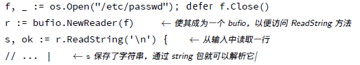

更加通用（但是也更加复杂）的方法是 ReadLine，参阅包 bufio 的文档了解更多内容。

在 shell 脚本中通常遇到的场景是需要检查某个目录是否存在，如果不存在，就创建一个。

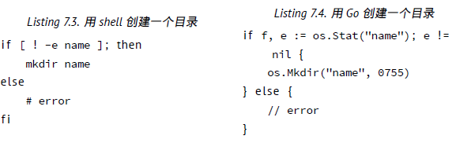

这两个例子的相似之处展示了 Go 拥有的“脚本” 化特性，例如，用 Go 编写程序感觉上类似使用动态语言（Python、Ruby、Perl 或者 PHP）。

## 命令行参数

来自命令行的参数在程序中通过字符串 slice os.Args 获取，导入包 os 即可。flag 包有着精巧的接口，同样提供了解析标识的方法。这个例子是一个 DNS 查询工具：

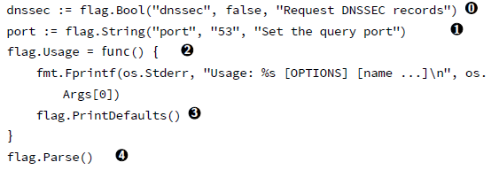

0 .定义 bool 标识，-dnssec。变量必须是指针，否则 package 无法设置其值；  
1. 类似的，port 选项；  
2. 简单的重定义Usage 函数，有点罗嗦；  
3. 指定的每个标识，PrintDefaults 将输出帮助信息；  
4. 解析标识，并填充变量。  

当参数被解析之后，就可以使用它们：

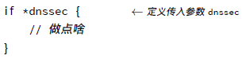

## 执行命令

os/exec 包有函数可以执行外部命令，这也是在 Go 中主要的执行命令的方法。通过定义一个有着数个方法的*exec.Cmd 结构来使用。

执行 ls -l：

```
import "os/exec"
cmd := exec.Command("/bin/ls", "-l")
err := cmd.Run()
```

上面的例子运行了 “ls -l”，但是没有对其返回的数据进行任何处理，通过如下方法从命令行的标准输出中获得信息：

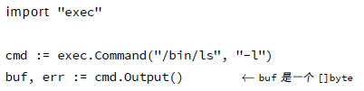

## 网络

所有网络相关的类型和函数可以在 net 包中找到。这其中最重要的函数是 Dial。当 Dial 到远程系统，这个函数返回 Conn 接口类型，可以用于发送或接收信息。函数 Dial 简洁的抽象了网络层和传输层。因此 IPv4 或者 IPv6，TCP 或者 UDP 可以共用一个接口。

通过 TCP 连接到远程系统（端口 80），然后是 UDP，最后是 TCP 通过 IPv6，大致是这样：

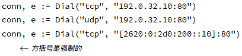

如果没有错误（由e 返回），就可以使用conn 从套接字中读写。在包net 中的原始定义是：

```
// Read reads data from the connection.
Read(b []byte)(n int, err error)
```

这使得 conn 成为了 io.Reader。

```
// Write writes data to the connection.
Write(b []byte)(n int, err error)
```

这同样使得 conn 成为了 io.Writer，事实上 conn 是 io.ReadWriter。

但是这些都是隐含的低层 c，通常总是应该使用更高层次的包。例如 http 包。一个简单的 http Get 作为例子：

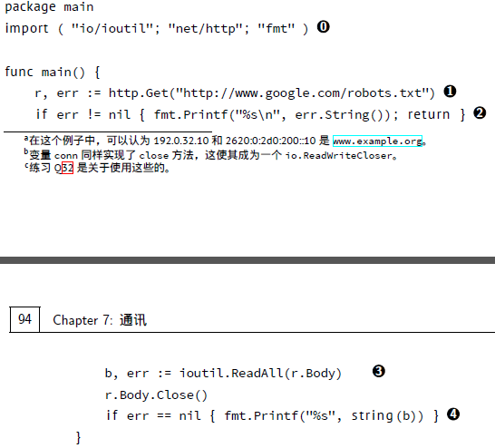

0 .需要的导入；  
1. 使用 http 的 Get 获取 html；
2. 错误处理；  
3. 将整个内容读入 b；  
4. 如果一切 OK 的话，打印内容。  

## 练习

**Q28**. (2) 进程

1. 编写一个程序，列出所有正在运行的进程，并打印每个进程执行的子进程个数。输出应当类似：

```
Pid 0 has 2 children: [1 2]
Pid 490 has 2 children: [1199 26524]
Pid 1824 has 1 child: [7293]
```

- 为了获取进程列表，需要得到 ps -e -opid,ppid,comm 的输出。输出类似：

```
PID PPID COMMAND
9024 9023 zsh
19560 9024 ps
```

- 如果父进程有一个子进程， 就打印 child， 如果多于一个， 就打印 children；
- 进程列表要按照数字排序，这样就以 pid 0 开始，依次展示。这里有一个 Perl 版本的程序来帮助上手（或者造成绝对的混乱）。

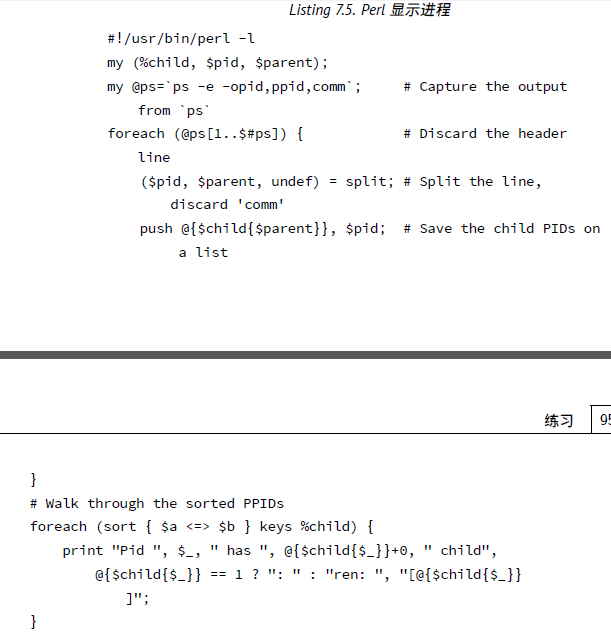

**Q29**. (0) 单词和字母统计

1 .编写一个从标准输入中读取文本的小程序，并进行下面的操作：  
  
1. 计算字符数量（包括空格）；  
2. 计算单词数量；  
3. 计算行数。

换句话说，实现一个 wc(1)（参阅本地的手册页面），然而只需要从标准输入读取。

**Q30**. (0) Uniq

1. 编写一个 Go 程序模仿 Unix 命令 uniq 的功能。程序应当像下面这样运行，提供一个下面这样的列表：  

```
'a' 'b' 'a' 'a' 'a' 'c' 'd' 'e' 'f' 'g'  
```

它将打印出没有后续重复的项目：  

```
'a' 'b' 'a' 'c' 'd' 'e' 'f'  
```

下面列出的 7.8 是 Perl 实现的算法。 

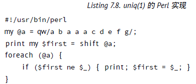

**Q31**. (2) Quine Quine 是一个打印自己的程序。

1. 用 Go 编写一个 Quine 程序。

**Q32**. (1) Echo 服务

1. 编写一个简单的 echo 服务。使其监听于本地的 TCP 端口 8053 上。它应当可以读取一行（以换行符结尾），将这行原样返回然后关闭连接。
2. 让这个服务可以并发，这样每个请求都可以在独立的 goroutine 中进行处理。

**Q33**. (2) 数字游戏

- 从列表中随机选择六个数字：

1; 2; 3; 4; 5; 6; 7; 8; 9; 10; 25; 50; 75; 100

数字可以多次被选中；

- 从 1 : : : 1000 中选择一个随机数i；

- 尝试用先前的六个数字（或者其中的几个）配合运算符+，􀀀， 和/，计算出 i；

例如，选择了数字：1，6，7，8，8 和 75。并且 i 为 977。可以用许多方法来实现，其中一种：

((((1  6)  8) + 75)  8) 􀀀 7 = 977

或者

(8  (75 + (8  6))) 􀀀 (7/1) = 977

1. 实现像这样的数字游戏。使其打印像上面那样格式的结果（也就是说，输出应当是带有括号的中序表达式）
2. 计算全部可能解，并且全部显示出来（或者仅显示有多少个）。在上面的例子中，有 544 种方法。

**Q34**. (1) *Finger 守护进程

1. 编写一个 finger 守护进程，可以工作于 finger(1) 命令。来自 Debian 的包描述：

Fingerd 是一个基于 RFC 1196 [28] 的简单的守护进程，它为许多站点提供了 “finger” 程序的接口。这个程序支持返回一个友好的、面向用户的系统或用户当前􂱥况的详细报告。

最基本的只需要支持用户名参数。如果用户有 .plan 文件，则显示该文件内容。因此程序需要能够提供：

- 用户存在吗？
- 如果用户存在，显示 .plan 文件的内容。

## 答案

**A28**. (2) 进程

1 .有许多工作需要做。可以将程序分为以下几个部分：

1. 运行 ps 获得输出；
2. 解析输出并保存每个 PPID 的子 PID；
3. 排序 PPID 列表；
4. 打印排序后的列表到屏幕。

在下面的解法中，使用了一个 map[int][]int，就是一个使用整数作为 map 的索引，元素是整数的 slice ——用于保存 PID。内建的 append 被用于扩展这个整数的 slice。

程序清单：

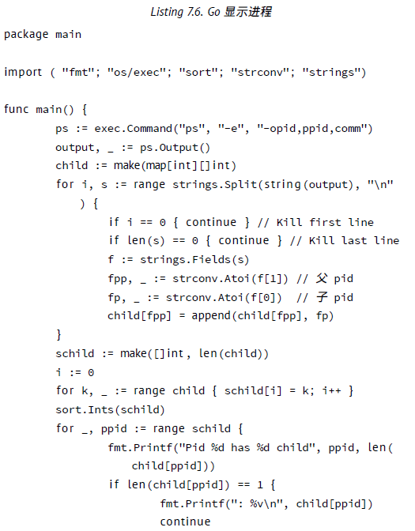

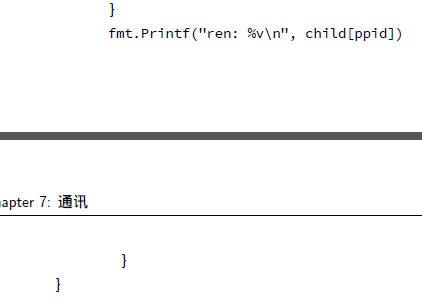

**A29**. (0) 单词和字母统计

1. 下面是 wc(1) 的一种实现。

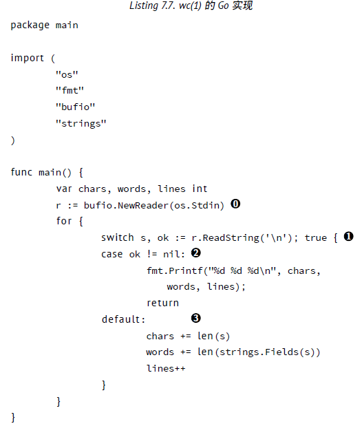

0 .Start a new reader that reads from standard input;  
1. Read a line from the input;  
2. If we received an error, we assume it was because of a EOF. So we print thecurrent values;  
3. Otherwise we count the charaters, words and increment the lines.  

**A30**. (0) Uniq

1. 下面是 uniq 的 Go 实现.

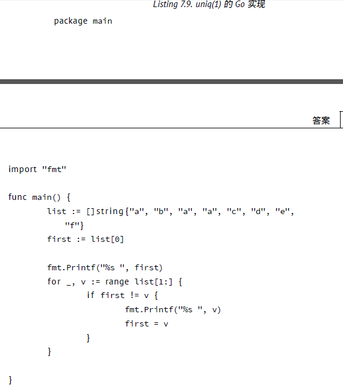

**A31**. (2) Quine

下面是来自 Russ Cox 提交在 Go Nuts 邮件列表上的解决方案。

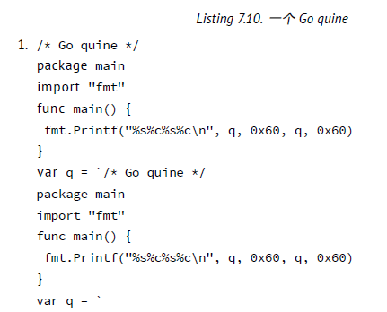

**A32**. (1) Echo 服务

1. 一个简单的 echo 服务器是这样：

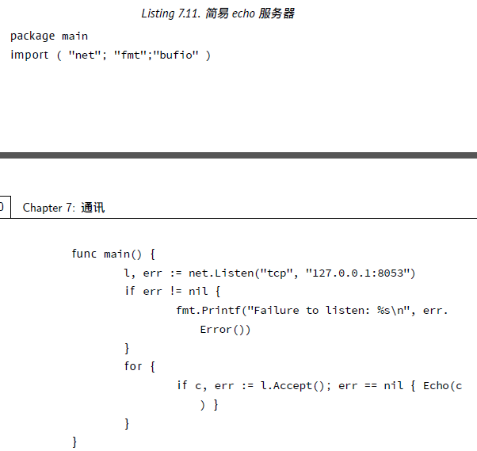

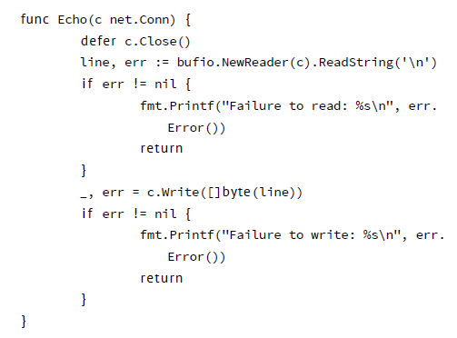

当运行起来的时候可以看到如下内容：

```
% nc 127.0.0.1 8053
Go is *awesome*
Go is *awesome*
```

2. 为了使其能够并发处理链接，只需要修改一行代码，就是：

```
i f c, err := l.Accept() ; err == nil { Echo(c) }
```

改为：

```
i f c, err := l.Accept() ; err == nil { go Echo(c) }
```

**A33**. (2) 数字游戏

1. 下面的是一种可能的解法。它使用了递归和回溯来得到答案。

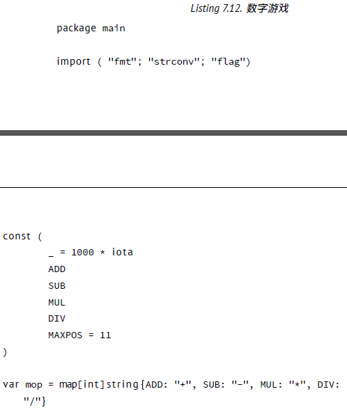

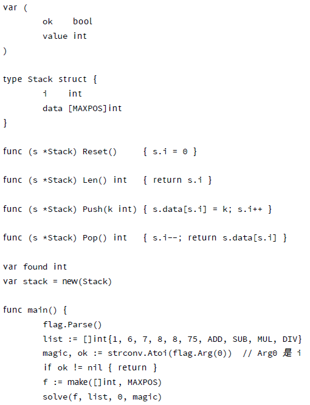

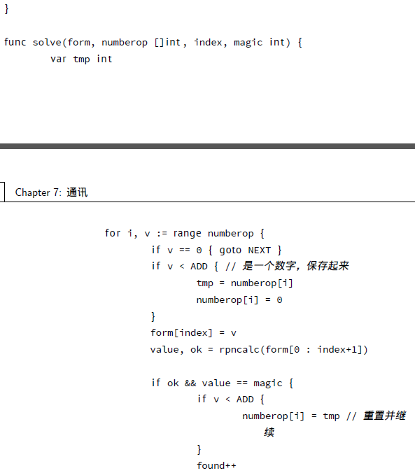

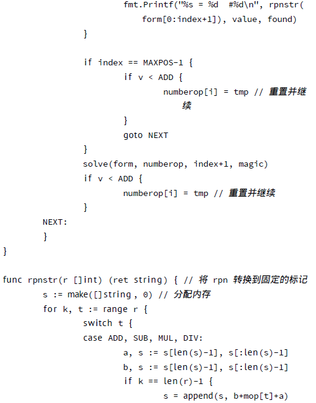

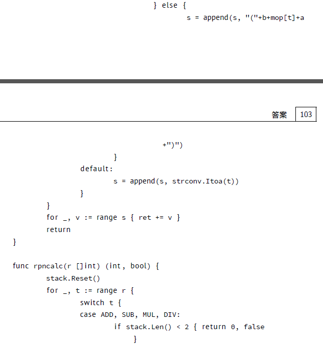

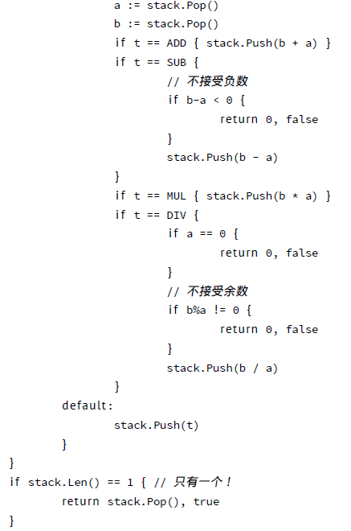

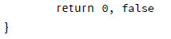

2. 开始运行 permrec 时，输入 977 作为第一个参数：

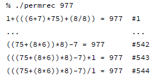

**A34**. (1) *Finger 守护进程

这是来自 Fabian Becker 的解决方案。

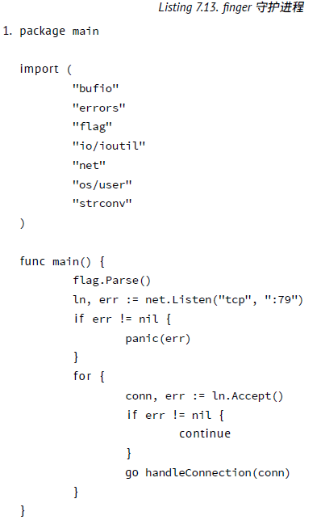

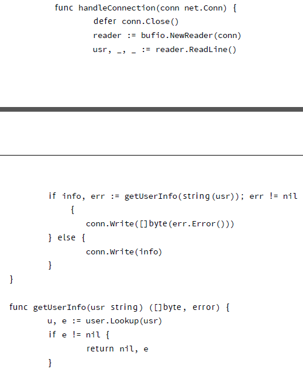

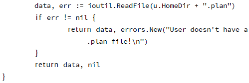


