# 并发

在这章中将展示 Go 使用 channel 和 goroutine 开发并行程序的能力。goroutine 是 Go并发能力的核心要素。但是，goroutine 到底是什么？来自 [8]：

叫做 goroutine 是因为已有的短语——线程、协程、进程等等——传递了不准确的含义。goroutine 有简单的模型：它是与其他 goroutine 并行执行的，有着相同地址空间的函数。它是轻量的，仅比分配栈空间多一点点消耗。而初始时栈是很小的，所以它们也是廉价的，并且随着需要在堆空间上分配（和释放）。

goroutine 是一个普通的函数，只是需要使用关键字 go 作为开头。

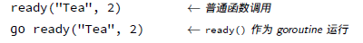

下面程序的思路来自 [20]。让一个函数作为两个 goroutine 执行，goroutine 等待一段时间，然后打印一些内容到屏幕。在第 14 和 15 行，启动了 goroutine。main 函数等待足够的长的时间，这样每个 goroutine 会打印各自的文本到屏幕。现在是在第 17 行等待 5 秒钟，但实际上没有任何办法知道，当所有 goroutine 都已经退出应当等待多久。

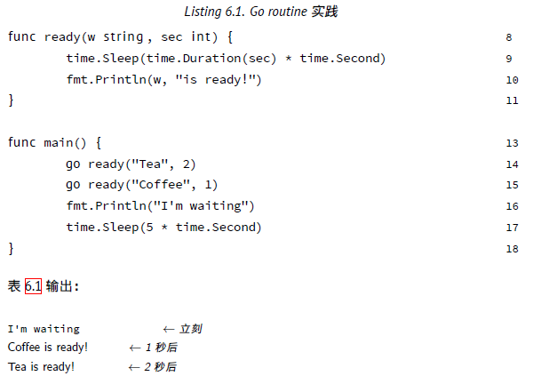

如果不等待 goroutine 的执行（例如，移除第 17 行），程序立刻终止，而任何正在执行的 goroutine 都会停止。为了修复这个，需要一些能够同 goroutine 通讯的机制。这一机制通过 channels 的形式使用。channel 可以与 Unix sehll 中的双向管道做类比：可以通过它发送或者接收值。这些值只能是特定的类型：channel 类型。定义一个 channel时，也需要定义发送到 channel 的值的类型。注意，必须使用 make 创建 channel：

```
ci := make(chan i n t )
cs := make(chan s t r i n g )
cf := make(chan i n t e r f a c e { })
```

创建 channel ci 用于发送和接收整数，创建 channel cs 用于字符串，以及 channel cf 使用了空接口来满足各种类型。向 channel 发送或接收数据，是通过类似的操作符完成的：<-. 具体作用则依赖于操作符的位置：

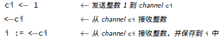

将这些放到实例中去。

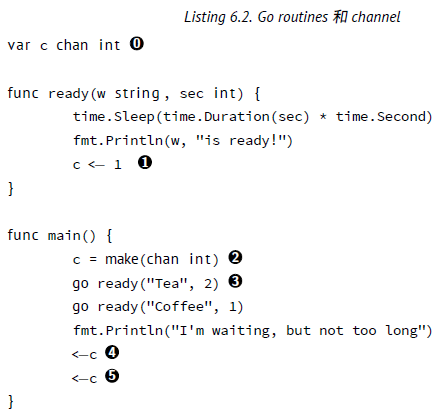

0 .定义 c 作为 int 型的 channel。就是说：这个 channel 传输整数。注意这个变量是全局的，这样 goroutine 可以访问它；
1. 发送整数 1 到 channel c；  
2. 初始化 c；  
3. 用关键字 go 开始一个 goroutine；  
4. 等待，直到从 channel 上接收一个值。注意，收到的值被丢弃了；  
5. 两个 goroutines，接收两个值。  

这里仍然有一些丑陋的东西；不得不从 channel 中读取两次（第 14 和 15 行）。在这个例子中没问题，但是如果不知道有启动了多少个 goroutine 怎么办呢？这里有另一个 Go 内建的关键字：select。通过 select（和其他东西）可以监听 channel 上输入的数据。

在这个程序中使用 select，并不会让它变得更短，因为运行的 goroutine 太少了。移除第 14 和 15 行，并用下面的内容替换它们：

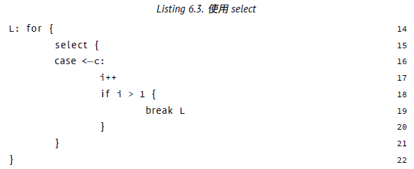

现在将会一直等待下去。只有当从 channel c 上收到多个响应时才会退出循环 L。

### 使其并行运行

虽然 goroutine 是并发执行的，但是它们并不是并行运行的。如果不告诉 Go 额外的东西，同一时刻只会有一个 goroutine 执行。利用 runtime.GOMAXPROCS(n) 可以设置 goroutine 并行执行的数量。来自文档：

GOMAXPROCS 设置了同时运行的 CPU 的最大数量，并返回之前的设置。如
果 n < 1，不会改变当前设置。当调度得到改进后，这将被移除。

如果不希望修改任何源代码，同样可以通过设置环境变量 GOMAXPROCS 为目标值。

## 更多关于 channel

当在 Go 中用 ch := make(chan bool) 创建 chennel 时，bool 型的无缓冲 channel 会被创建。这对于程序来说意味着什么呢？首先，如果读取（value := <􀀀ch）它将会被阻塞，直到有数据接收。其次，任何发送（ch<􀀀5）将会被阻塞，直到数据被读出。无缓冲 channel 是在多个 goroutine 之间同步很棒的工具。

不过 Go 也允许指定 channel 的缓冲大小，很简单，就是 channel 可以存储多少元素。ch := make(chan bool, 4)，创建了可以存储 4 个元素的 bool 型 channel。在这个 channel 中，前 4 个元素可以无阻塞的写入。当写入第 5 元素时，代码将会阻塞，直到其他 goroutine 从channel 中读取一些元素，腾出空间。

一句话说，在 Go 中下面的为 true：

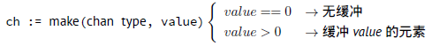

### 关闭 channel

当 channel 被关闭后，读取端需要知道这个事情。下面的代码演示了如何检查 channel 是否被关系。

```
x, ok = <􀀀ch
```

当 ok 被赋值为 true 意味着 channel 尚未被关闭，同时可以读取数据。否则 ok 被赋值为 false。在这个情况下表示 channel 被关闭。

只读或只写 channel

## 练习

**Q26**. (1) Channel

1. 修改在练习 Q1 中创建的程序， 换句话说， 主体中调用的函数现在是一个 goroutine 并且使用 channel 通讯。不用担心 goroutine 是如何停止的。

2. 在完成了问题 1 后，仍有一些待解决的问题。其中一个麻烦是 goroutine 在 main.main() 结束的时候，没有进行清理。更糟的是，由于 main.main() 和 main.shower() 的竞争关系，不是所有数字都被打印了。本应该打印到 9，但是有时只打印到 8。添加第二个退出 channel，可以解决这两个问题。试试吧。

**Q27**. (2) 斐波那契 II

1. 这是类似的练习，第一个在第 34 页的练习 10。完整的问题描述：

斐波那契数列以： 1; 1; 2; 3; 5; 8; 13; : : : 开头。或用数学形式： x1 = 1; x2 = 1; xn = xn􀀀1 + xn􀀀2 8n > 2。

编写一个函数接收 int 值，并给出同样数量的斐波那契数列。

但是现在有额外条件：必须使用 channel。

## 答案

**A26**. (1) Channel

1. 程序可能的形式是：

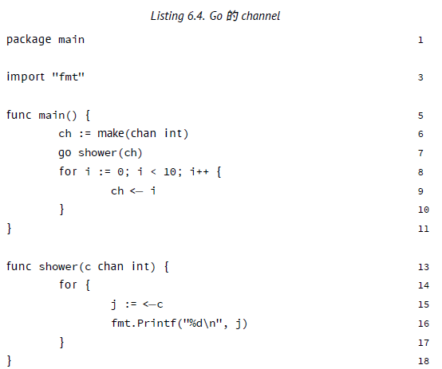

以通常的方式开始，在第 6 行创建了一个新的 int 类型的 channel。下一行调用了 shower 函数，用 ch 变量作为参数，这样就可以与其通讯。然后进入 for 循环（第 8-10 行），在循环中发送（通过<􀀀）数字到函数（现在是 goroutine）shower。在函数 shower 中等待（阻塞方式），直到接收到了数字（第 15 行）。每个收到的数字都被打印（第 16 行）出来，然后继续第 14 行开始的死循环。

2 .答案是

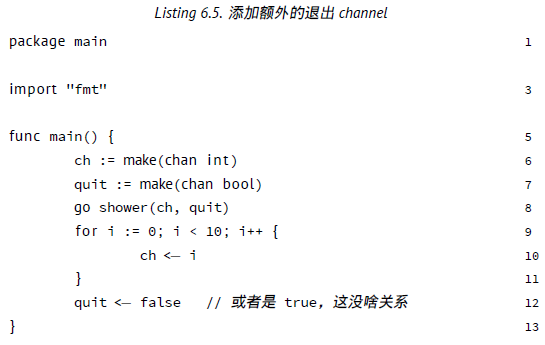


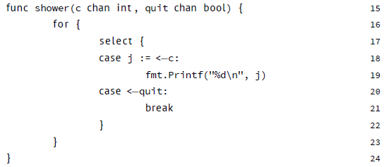

在第 20 行从退出 channel 读取并丢弃该值。可以使用 q := <􀀀quit，但是可能只需要用这个变量一次——在 Go 中是非法的。另一种办法，你可能已经想到了：_ = <􀀀quit。在 Go 中这是合法的，但是第 20 行的形式在 Go 中更好。

**A27**. (2) 斐波那契 II

1. 下面的程序使用 channel 计算了斐波那契数列。

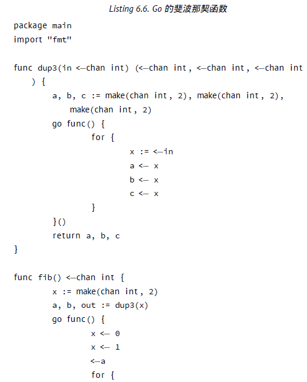

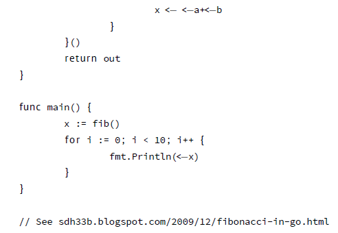