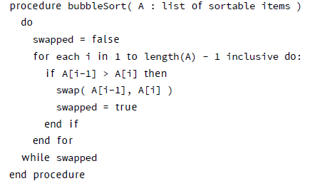
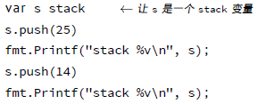

# 函数

函数是构建 Go 程序的基础部件；所遇有趣的事情都是在它其中发生的。函数的定义看起来像这样：


0 .关键字 func 用于定义一个函数；  
1. 函数可以绑定到特定的类型上。这叫做接收者。有接收者的函数被称作 method。第 5 章将对其进行说明；  
2. funcname 是你函数的名字；  
3. int 类型的变量 q 作为输入参数。参数用 pass-by-value 方式传递，意味着它们会被复制；  
4. 变量 r 和 s 是这个函数的命名返回值。在 Go 的函数中可以返回多个值。参阅第 28 页的“多值返回”。如果不想对返回的参数命名，只需要提供类型：(int,int)。 如果只有一个返回值，可以省略圆括号。如果函数是一个子过程，并且没有任何
返回值，也可以省略这些内容；  
5. 这是函数体。注意 return 是一个语句，所以包裹参数的括号是可选的。  

这里有两个例子，左边的函数没有返回值，右边的只是简单的将输入返回。

```
func subroutine(in i n t ) { return }

func identity(in i n t ) i n t { return in }

```

可以随意安排函数定义的顺序，编译器会在执行前扫描每个文件。所以函数原型在 Go 中都是过期的旧物。Go 不允许函数嵌套，然而你可以利用匿名函数实现它，参阅本章第31 页的“函数作为值”。

递归函数跟其他语言是一样的：


## 作用域

在 Go 中，定义在函数外的变量是全局的，那些定义在函数内部的变量，对于函数来说 是局部的。如果命名覆盖——一个局部变量与一个全局变量有相同的名字——在函数 执行的时候，局部变量将覆盖全局量。


在 2.3 中定义了函数 q() 的局部变量 a。局部变量 a 仅在 q() 中可见。这也就是为什么代码会打印：656。在 2.4 中没有定义局部变量，只有全局变量 a。这将使得对 a 的赋值全局可见。这段代码将会打印：655。

在下面的例子中，我们在 f() 中调用 g()：

Listing 2.5. 当函数调用函数时的作用域


输出内容将是：565。局部变量仅仅在执行定义它的函数时有效。

## 多值返回

Go 一个非常特别的特性（对于编译语言而言）是函数和方法可以返回多个值（Python和　Perl 同样也可以）。这可以用于改进一大堆在　C 程序中糟糕的惯例用法：修改参数的方式，返回一个错误（例如遇到　EOF 则返回　-1）。在　Go 中，Write 返回一个计数值和一个错误：“是的，你写入了一些字节，但是由于设备异常，并不是全部都写入了。”　os 包中的 *File.Write 是这样声明的：

```
func (file *File) Write(b []byte) (n int , err e r r o r )
```

如同文档所述，它返回写入的字节数，并且当 n != len(b) 时，返回非 nil 的 error。这是 Go 中常见的方式。

元组没有作为原生类型出现，所以多返回值可能是最佳的选择。你可以精确的返回希望的值，而无须重载域空间到特定的错误信号上。

## 命名返回值

Go 函数的返回值或者结果参数可以指定一个名字，并且像原始的变量那样使用，就像输入参数那样。如果对其命名，在函数开始时，它们会用其类型的零值初始化。如果函数在不加参数的情况下执行了 return 语句，结果参数会返回。用这个特性，允许（再一次的）用较少的代码做更多的事。

名字不是强制的，但是它们可以使得代码更加健壮和清晰：这是文档。例如命名 int 类型的 nextPos 返回值，就能说明哪个代表哪个。

```
func nextInt(b []byte, pos i n t ) (value, nextPos i n t ) { /* ... */ }
```

由于命名结果会被初始化并关联于无修饰的 return，它们可以非常简单并且清晰。这里有一段 io.ReadFull 的代码，很好的运用了它：


## 延迟代码

假设有一个函数，打开文件并且对其进行若干读写。在这样的函数中，经常有提前返回的地方。如果你这样做，就需要关闭正在工作的文件描述符。这经常导致产生下面的代码：


在这里有许多重复的代码。为了解决这些，Go 有了 defer 语句。在 defer 后指定的函数会在函数退出前调用。

上面的代码可以被改写为下面这样。将 Close 对应的放置于 Open 后，能够使函数更加可读、健壮。


可以将多个函数放入“延迟列表”中，这个例子来自 [8]：


延迟的函数是按照后进先出（LIFO）的顺序执行，所以上面的代码打印：4 3 2 1 0。利用 defer 甚至可以修改返回值，假设正在使用命名结果参数和函数符号，例如：


或者这个例子，更加容易了解为什么，以及在哪里需要括号：


在这个（匿名）函数中，可以访问任何命名返回参数：


## 变参

接受不定数量的参数的函数叫做变参函数。定义函数使其接受变参：

```
func myfunc(arg ... i n t ) { }
```

arg ...int 告诉 Go 这个函数接受不定数量的参数。注意，这些参数的类型全部是 int。在函数体中，变量 arg 是一个 int 类型的 slice：


如果不指定变参的类型，默认是空的接口 interface{}（参阅第 5 章）。假设有另一个变参函数叫做 myfunc2，下面的例子演示了如何向其传递变参：


## 函数作为值

就像其他在 Go 中的其他东西一样，函数也是值而已。它们可以像下面这样赋值给变量：


如果使用 fmt.Printf("\%T\n", a) 打印 a 的类型，输出结果是 func()。

函数作为值，也会被用在其他地方，例如 map。这里将整数转换为函数：


也可以编写一个接受函数作为参数的函数，例如用于操作 int 类型的 slice 的 Map 函数。这是一个留给读者的练习，参考在第 34 页的练习 Q11。

## 回调

由于函数也是值，所以可以很容易的传递到其他函数里，然后可以作为回调。首先定义一个函数，对整数做一些“事情”：


这个函数的标识是 func printit(int)，或者没有函数名的：func(int)。创建新的函数使用这个作为回调，需要用到这个标识：


## 恐慌（Panic）和恢复（Recover）

Go 没有像 Java 那样的异常机制，例如你无法像在 Java 中那样抛出一个异常。作为替代，它使用了恐慌和恢复（panic-and-recover）机制。一定要记得，这应当作为最后的手段被使用，你的代码中应当没有，或者很少的令人恐慌的东西。这是个强大的工具，明智的使用它。那么，应该如何使用它呢。下面的描述来自于[7]：

### Panic

是一个内建函数，可以中断原有的控制流程，进入一个令人恐慌的流程中。当函数F 调用 panic，函数 F 的执行被中断，并且 F 中的延迟函数会正常执行，然后F 返回到调用它的地方。在调用的地方，F 的行为就像调用 panic。这一过程继续向上，直到程序崩溃时的所有 goroutine 返回。

恐慌可以直接调用 panic 产生。也可以由运行时错误产生，例如访问越界的数组。

### Recover

是一个内建的函数，可以让进入令人恐慌的流程中的 goroutine 恢复过来。recover 仅在延迟函数中有效。

在正常的执行过程中，调用 recover 会返回 nil 并且没有其他任何效果。如果当前的 goroutine 陷入恐慌，调用 recover 可以捕获到 panic 的输入值，并且恢复正常的执行。

这个函数检查作为其参数的函数在执行时是否会产生 panic：


0 .定义一个新函数 throwsPanic 接受一个函数作为参数（参看“函数作为值”）。函数 f 产生 panic，就返回 true，否则返回 false；  
1. 定义了一个利用 recover 的 defer 函数。如果当前的 goroutine 产生了 panic，这个 defer 函数能够发现。当 recover() 返回非 nil 值，设置 b 为 true；  
2 .调用作为参数接收的函数;  
3. 返回 b 的值。由于 b 是命名返回值。

（第 28 页），无须指定 b。

## 练习

**Q5**. (0) 平均值

1. 编写一个函数用于计算一个 float64 类型的 slice 的平均值。

**Q6**. (0) 整数顺序

1. 编写函数，返回其（两个）参数正确的（自然）数字顺序：

f(7,2) ! 2,7  
f(2,7) ! 2,7

**Q7**. (1) 作用域

1. 下面的程序有什么错误？


**Q8**. (1) 栈

1. 创建一个固定大小保存整数的栈。它无须超出限制的增长。定义 push 函数——将数据放入栈，和 pop 函数——从栈中取得内容。栈应当是后进先出（LIFO）的。


2 .更进一步。编写一个 String 方法将栈转化为字符串形式的表达。可以这样的方式打印整个栈：fmt.Printf("My stack %v\n", stack)

栈可以被输出成这样的形式：[0:m] [1:l] [2:k]

**Q9**. (1) 变参

1. 编写函数接受整数类型变参，并且每行打印一个数字。

**Q10**. (1) 斐波那契

1. 斐波那契数列以：1; 1; 2; 3; 5; 8; 13; : : : 开始。或者用数学形式表达：x1 = 1; x2 =
1; xn = xn􀀀1 + xn􀀀2 8n > 2。

编写一个接受 int 值的函数，并给出这个值得到的斐波那契数列。

**Q11**. (1) map 函数

map() 函数是一个接受一个函数和一个列表作为参数的函数。函数应用于列表中的每个元素，而一个新的包含有计算结果的列表被返回。因此：

map(f(); (a1; a2; : : : ; an􀀀1; an)) = (f(a1); f(a2); : : : ; f(an􀀀1); f(an))

1. 编写 Go 中的简单的 map() 函数。它能工作于操作整数的函数就可以了。  
2. 扩展代码使其工作于字符串列表。

**Q12**. (0) 最小值和最大值

1. 编写一个函数，找到 int slice ([]int) 中的最大值。  
2. 编写一个函数，找到 int slice ([]int) 中的最小值。

**Q13**. (1) 冒泡排序

1. 编写一个针对int 类型的slice 冒泡排序的函数。这里[24]：

它在一个列表上重复步骤来排序，比较每个相􄩪的元素，并且顺序错误的时候，交换它们。一遍一遍扫描列表，直到没有交换为止，这意味着列表排序完成。算法得名于更小的元素就像“泡泡” 一样冒到列表的􅈥端。

[24] 这里有一个过程代码作为示例：



**Q14**. (1) 函数返回一个函数

1. 编写一个函数返回另一个函数，返回的函数的作用是对一个整数 +2。函数的名称叫做 plusTwo。然后可以像下面这样使用：

```
p := plusTwo()  
fmt.Printf("%v\n", p(2))
```

应该打印 4。参阅第 31 页的“回调” 小节了解更多相关信息。

2 .使 1 中的函数更加通用化，创建一个 plusX(x) 函数，返回一个函数用于对整数加上 x。

## 答案

**A5**. (0) 平均值

1. 下面的函数计算平均值。


0 .可以使用命名返回值；  
1. 如果长度是零，返回 0；  
2. 否则，计算平均值；  
3. 为了使除法能正常计算，必须将值转换为 float64；  
4. 得到平均值，返回它  

**A6**. (0) 整数顺序

1. 这里可以利用 Go 中的多返回值（参阅“多值返回” 小节）：


**A7**. (1) 作用域

1. 这个程序不能被编译，由于第 9 行的变量 i，未定义：i 仅在 for 循环中有效。为了修正这个，main() 应修改为：


现在 i 在 for 循环外定义，并且在其后仍然可访问。这会打印数字从 0 到 10。

**A8**. (1) 栈

1. 首先定义一个新的类型来表达栈；需要一个数组（来保存键）和一个指向最后一个元素的索引。这个小栈只能保存 10 个元素。


然后需要 push 和 pop 函数来使用这个。首先展示一下错误的解法！ 在 Go 的数据传递中，是值传递，意味着一个副本被创建并传递给函数。push 函数的第一个版本大约是这样：


函数对 stack 类型的变量 s 进行处理。调用这个，只需要 s.push(50)，将整数 50 放入栈中。但是 push 函数得到的是 s 的副本，所以它不会有真正的结果。用这个方法，不会有内容放入栈中，例如下面的代码：



打印：

```
stack [0:0]  
stack [0:0]
```

为了解决这个，需要向函数 push 提供一个指向栈的指针。这意味着需要修改 push

```
func (s stack)push(k int)→func (s *stack)push(k int)
```

应当使用 new()（参阅第 4 章“用 new 分配内存” 小节）创建指针指向的 stack的空间，因此例子中的第1 行需要是 s := new(stack) 

而两个函数变为：


像下面这样使用


2 .这里有一个额外的问题，对于这个练习中编写打印栈的代码的时候非常有价值。根据 Go 文档 fmt.Printf("\%v") 可以打印实现了 Stringer 接口的任何值（%v）。为了使其工作，需要为类型定义一个 String() 函数：


**A9**. (1) 变参

1. 需要使用... 语法来实现函数接受若干个数字作为变参。


**A10**. (1) 斐波那契

1. 下面的程序会计算出斐波那契数列。


0 .创建一个用于保存函数执行结果的 array；  
1. 开始计算斐波那契数列；    
2. xn = xn-1 + xn-2;    
3. 返回整个 array；  
4. 使用关键字 range 可以“遍历” 数字得到斐波那契函数返回的序列。这里有 10 个，且打印了出来。  

**A11**. (1) map 函数


2 .字符串问题的答案

**A12**. (0) 最小值和最大值

1. 这个函数返回 slice l 中的最大整数：


0 .使用了命名返回参数；  
1. 对 l 循环。元素的序号不重要；  
2. 如果找到了新的最大值，记住它；  
3. 一个“遥远的” 返回，当前的 max 值被返回。  

2. 这个函数返回 slice l 中的最小整数，这几乎与 max 完全一致。


有心的读者可能已经将 max 和 min 合成一个函数，用一个选择来判断是取最小值还是最大值，或者两个值都返回。

**A13**. (1) 冒泡排序

1. 冒泡排序并不是最有效率的，对于 n 个元素它的算法复杂度是 O(n2)。快速排序 [17] 是更好的排序算法。

但是冒泡排序容易实现。


由于 slice 是一个引用类型，bubblesort 函数可以工作，并且无须返回排序后的 slice。

**A14**. (1) 函数返回一个函数


0 .定义新的函数返回一个函数。看看你写的跟要表达的意思是如何的；  
1. 函数符号，在返回语句中定义了一个 +2 的函数。  
2. 这里我们使用闭包：


0 .再次定义一个函数返回一个函数；
1. 在函数符号中使用局部变量 x。