# 接口

在 Go 中，关键字 interface 被赋予了多种不同的含义。每个类型都有接口，意味着对那个类型定义了方法集合。这段代码定义了具有一个字段和两个方法的结构类型 S。

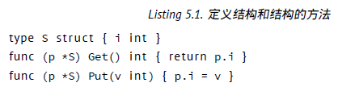

也可以定义接口类型，仅仅是方法的集合。这里定义了一个有两个方法的接口 I：

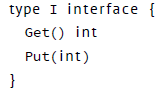

对于接口 I，S 是合法的实现，因为它定义了 I 所需的两个方法。注意，即便是没有明确定义 S 实现了 I，这也是正确的。

Go 程序可以利用这个特点来实现接口的另一个含义，就是接口值:

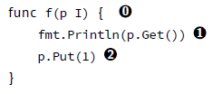

0 .定义一个函数接受一个接口类型作为参数；  
1. p 实现了接口I，必须有 Get() 方法；  
2. Put() 方法是类似的。

这里的变量 p 保存了接口类型的值。因为 S 实现了 I，可以调用 f 向其传递 S 类型的值的指针：

```
var s S ; f(&s)
```

获取 s 的地址，而不是 S 的值的原因，是因为在 s 的指针上定义了方法，参阅上面的代码 5.1。这并不是必须的——可以定义让方法接受值——但是这样的话 Put 方法就不会像期望的那样工作了。

实际上，无须明确一个类型是否实现了一个接口意味着 Go 实现了叫做 duck typing[26] 的模式。这不是纯粹的 duck typing，因为如果可能的话 Go 编译器将对类型是否实现了接口进行实现静态检查。然而，Go 确实有纯粹动态的方面，如可将一个接口类型转换到另一个。通常情况下，转换的检查是在运行时进行的。如果是非法转换——当在已有接口值中存储的类型值不匹配将要转换到的接口——程序会抛出运行时错误。

在 Go 中的接口有着与许多其他编程语言类似的思路：C++ 中的纯抽象虚基类，Haskell 中的 typeclasses 或者 Python 中的 duck typing。然而没有其他任何一个语言联合了接口值、静态类型检查、运行时动态转换，以及无须明确定义类型适配一个接口。这些给 Go 带来的结果是，强大、灵活、高效和容易编写的。

### 到底是什么？

来定义另外一个类型同样实现了接口 I：

```
type R s t r u c t { i i n t }
func (p *R) Get() i n t { return p.i }
func (p *R) Put(v i n t ) { p.i = v }
```

函数 f 现在可以接受类型为 R 或 S 的变量。假设需要在函数 f 中知道实际的类型。在 Go 中可以使用 type switch 得到。

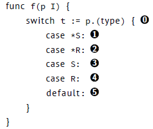
 
0 .类型判断。在 switch 语句中使用 (type)。保存类型到变量 t；  
1. p 的实际类型是 S 的指针；  
2. p 的实际类型是 R 的指针；  
3. p 的实际类型是 S；  
4. p 的实际类型是 R；  
5. 实现了 I 的其他类型。

在 switch 之外使用 (type) 是非法的。类型判断不是唯一的运行时得到类型的方法。为了在运行时得到类型，同样可以使用 “comma, ok” 来判断一个接口类型是否实现了某个特定接口：

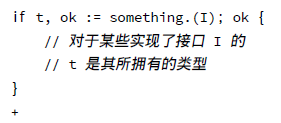

确定一个变量实现了某个接口，可以使用：

```
t := something.(I)
```

### 空接口

由于每个类型都能匹配到空接口：interface{}。我们可以创建一个接受空接口作为参数的普通函数：

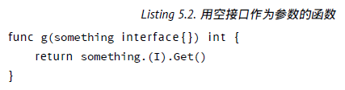

在这个函数中的 return something.(I).Get() 是有一点窍门的。值 something 具有类型 interface{}，这意味着方法没有任何约束：它能包含任何类型。.(I) 是类型断言，用于转换 something 到 I 类型的接口。如果有这个类型，则可以调用 Get() 函数。因此，如果创建一个 *S 类型的新变量，也可以调用 g()，因为 *S 同样实现了空接口。

```
s = new(S)
fmt.Println(g(s)) ;
```

调用 g 的运行不会出问题，并且将打印 0。如果调用 g() 的参数没有实现 I 会带来一个麻烦：

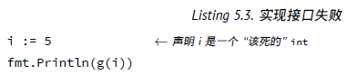

这能编译，但是当运行的时候会得到：

```
panic: interface conversion: int is not main.I: missing method Get
```

这是绝对没问题，内建类型 int 没有 Get() 方法。

## 方法

方法就是有接收者的函数（参阅第 2 章）。

可以在任意类型上定义方法（除了非本地类型，包括内建类型：int 类型不能有方法）。然而可以新建一个拥有方法的整数类型。例如：

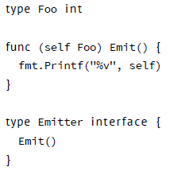

对那些非本地（定义在其他包的）类型也一样：

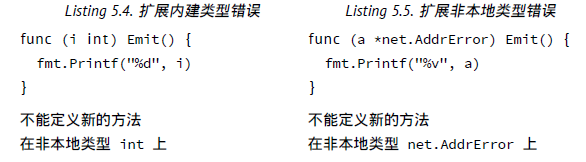

### 接口类型的方法

接口定义为一个方法的集合。方法包含实际的代码。换句话说，一个接口就是定义，而方法就是实现。因此，接收者不能定义为接口类型，这样做的话会引起 invalid receiver type ... 的编译器错误。来自语言说明书 [10] 的权威内容：

接收者类型必须是 T 或 *T，这里的 T 是类型名。T 叫做接收者基础类型或简称基础类型。基础类型一定不能使指针或接口类型，并且定义在与方法相同的包中。

>Pointers to interfaces
  
>在 Go 中创建指向接口的指针是无意义的。实际上创建接口值的指针也是非法的。在 2010-10-13 的发布日志中进行的描述，使得没有任何余地怀疑这一事实：

>语言的改变是使用指针指向接口值不再自动反引用指针。指向接口值的指针通常是低级的错误，而不是正确的代码。

>这来自[9]。如果不是这个限制，这个代码：

```
var buf bytes.Buffer
io.Copy(buf, os.Stdin)
```

>就会复制标准输入到 buf 的副本，而不是 buf 本身。这看起来永远不会是一个期望的结果。

## 接口名字

根据规则，单方法接口命名为方法名加上-er 后缀：Reader，Writer，Formatter 等。

有一堆这样的命名，高效的反映了它们职责和包含的函数名。Read，Write，Close，Flush，String 等等有着规范的声明和含义。为了避免混淆，除非有类似的声明和含义，否则不要让方法与这些重名。相反的，如果类型实现了与众所周知的类型相同的方法，那么就用相同的名字和声明；将字符串转换方法命名为 String 而不是 ToString。

## 简短的例子

回顾那个冒泡排序的练习 Q13），对整型数组排序：

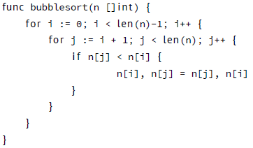

排序字符串的版本是类似的，除了函数的声明：

```
func bubblesortString(n [] s t r i n g ) { /* ... */ }
```

基于此，可能会需要两个函数，每个类型一个。而通过使用接口可以让这个变得更加通用。

来创建一个可以对字符串和整数进行排序的函数，这个例子的某些行是无法运行的：

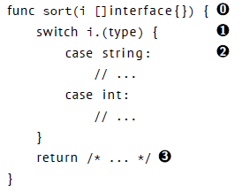

0. 函数将接收一个空接口的 slice；
1. 使用 type switch 找到输入参数实际的类型；
2. 然后排序；
3. 返回排序的 slice。

但是如果用 sort([]int{1, 4, 5}) 调用这个函数，会失败：cannot use i (type []int) as type []interface in function argument

这是因为 Go 不能简单的将其转换为接口的 slice。转换到接口是容易的，但是转换到 slice 的开销就高了。

简单来说 ：Go 不能（隐式）转换为 slice。

那么如何创建 Go 形式的这些“通用” 函数呢？用 Go 隐式的处理来代替 type switch 方式的类型推断吧。下面的步骤是必须的：

1. 定义一个有着若干排序相关的方法的接口类型（这里叫做 Sorter）。至少需要获取 slice 长度的函数，比较两个值的函数和交换函数；

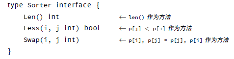

2 .定义用于排序 slice 的新类型。注意定义的是 slice 类型；

```
type Xi [] i n t
type Xs [] s t r i n g
```

3 .实现 Sorter 接口的方法。整数的：

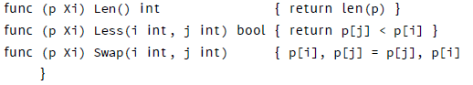

和字符串的：

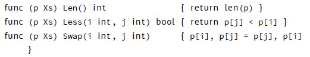

4 .编写作用于 Sorter 接口的通用排序函数。

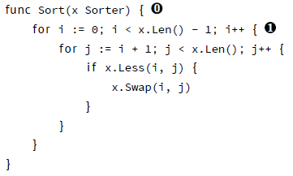

0 .x 现在是 Sorter 类型；  
1. 使用定义的函数，实现了冒泡排序。

现在可以像下面这样使用通用的 Sort 函数：

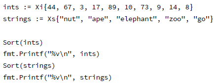

### 在接口中列出接口

看一下下面的接口定义，这个是来自包 container/heap 的：

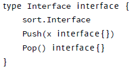

这里有另外一个接口在 heap.Interface 的定义中被列出，这看起来有些古怪，但是这的确是正确的，要记得接口只是一些方法的列表。sort.Interface 同样是这样一个列表，因此将其包含在接口内是毫无错误的。

### 自省和反射

在下面的例子中，了解一下定义在 Person 的定义中的“标签”（这里命名为 “namestr”）。为了做到这个，需要 reflect 包（在 Go 中没有其他方法）。要记得，查看标签意味着返回类型的定义。因此使用 reflect 包来指出变量的类型，然后访问标签。

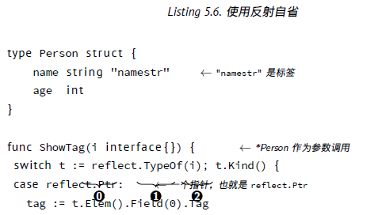

0 .We are dealing with a Type and according to the documentationa:

```
// Elem returns a type’s element type.
// It panics if the type’s Kind is not Array, Chan, Map, Ptr, or Slice.
Elem() Type
```

同样的在 t 使用 Elem() 得到了指针指向的值。

1. 现在已经定义了可以“深入”结构体的指针。就可以使用 Field(0) 访问零值字段；
2. 结构 StructField 有成员 Tag，返回字符串类型的标签名。因此，在第 0th 个字段上可以用 .Tag 访问这个名字：Field(0).Tag。这样得到了 namestr。

为了让类型和值之间的区别更加清晰，看下面的代码：

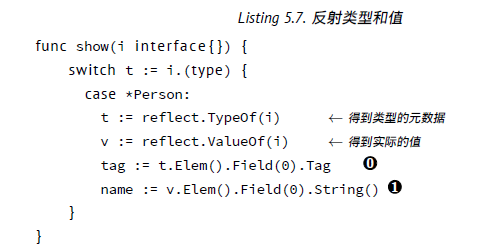

0 .这里希望获得“标签”。因此需要 Elem() 重定向至其上，访问第一个字段来获取标签。注意将 t 作为一个 reflect.Type 来操作；

1. 现在需要访问其中一个成员的值，并让 v 上的 Elem() 进行重定向。这样就访问到了结构。然后访问第一个字段Field (0) 并且调用其上的 String() 方法。

Figure 5.1. 用反射去除层次关系。通过 Elem() 访问 *Person，使用 go doc reflect 中描述的方法获得 string 内部包含的内容。

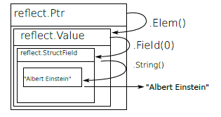

设置值与获得值类似，但是仅仅工作在可导出的成员上。这些代码：

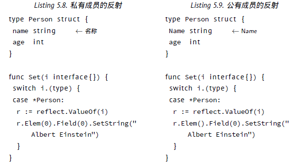

左边的代码可以编译并运行，但是当运行的时候，将得到打印了栈的运行时错误：

```
panic: reflect.Value.SetString using value obtained using unexported
field
```

右边的代码没有问题，并且设置了成员变量 Name 为 “Albert Einstein”。当然，这仅仅工作于调用 Set() 时传递一个指针参数。

## 练习

**Q23**. (1) 接口和编译

1. 在第 72 页的代码 5.3 编译正常——就像文中开始描述的那样。但是当运行的时候，会得到运行时错误，因此有些东西有错误。为什么代码编译没有问题呢？

**Q24**. (1) 指针和反射

1. 在第“自省和反射” 节，第 76 页的最后一段中，有这样的描述：

右边的代码没有问题，并且设置了成员变量 Name 为 “Albert Einstein”。当然，这仅仅工作于调用 Set() 时传递一个指针参数。

为什么是这样的情况？

**Q25**. (2) 接口和 max()

1. 在练习 Q12 中创建了工作于一个整形 slice 上的最大函数。现在的问题是创建一个显示最大数字的程序，同时工作于整数和浮点数。虽然在这里会相当困难，不过还是让程序尽可能的通用吧。

## 答案

A23. (1) 接口和编译

1. 代码能够编译是因为整数类型实现了空接口，这是在编译时检查的。

修复这个正确的途径是测试这个空接口可以被转换，如果可以，调用对应的方法。5.2 列出的 Go 代码中定义了函数 g ——这里重复一下：

```
func g(any i n t e r f a c e { }) i n t { return any.(I).Get() }
```

应当修改为：

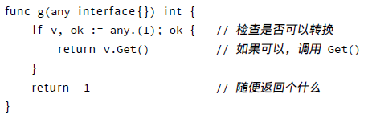

如果现在调用 g()，就不会有运行时错误了。在 Go 中这种用法被称作“comma ok”。

A24. (1) 指针和反射

1. 当调用一个非指针参数，变量是复制（call-by-value）的。因此，进行魔法般的反射是在副本上。这样就不能改变原来的值，仅仅改变副本。

A25. (2) 接口和 max()

1. 下面的程序计算了最大值。它是 Go 能做到的最通用的形式了。

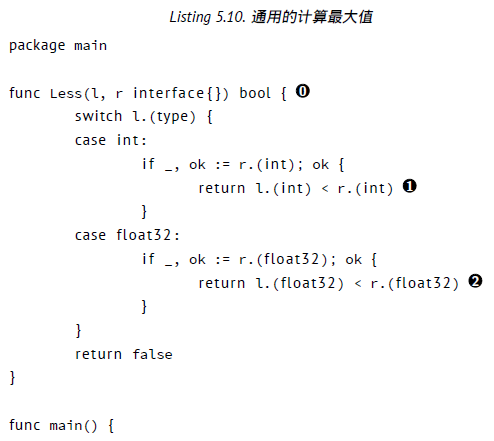

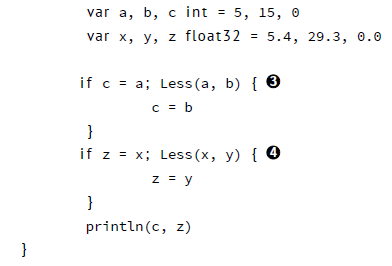

0 .也可以选择让这个函数的返回值为 interface{}，但是这也就意味着调用者不得不总是使用类型断言来从接口中解析出实际的类型；  
1. 所有类型定义为整数。然后进行比较；  
2. 参数是 float32；  
3. 获得 a 和 b 中的最大值；  
4. 浮点类型也一样。  

