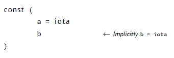

# 简介

什么是 Go？来自其网站 [13] 的介绍：

Go 编程语言是一个使得程序员更加有效率的开源项目。Go 是有表达力、简洁、清晰和有效率的。它的并行机制使其很容易编写多核和网络应用，而新奇的类型系统允许构建有弹性的模块化程序。Go 编译到机器码非常快速，同时具有便利的垃圾回收和强大的运行时反射。它是快速的、静态类型编译语言，但是感觉上是动态类型的，解释型语言。

Go 1 是 Go 语言的第一个稳定发布版本。本文档的所有练习都工作于 Go 1 – 如果不能
工作，那就一定是 bug。

本书使用了下面的约定：

- 代码、关键字和注释使用 Source Code Pro 显示；
- 代码中的额外标识←像这样显示；
- 较长的标识提供数字– 1 – 详细解释在其后显示；
- （如果需要）行号在右边显示；
- shell 的例子使用 % 作为输入符；
- 用户在 shell 输入内容的例子用**黑体显示**，系统反馈用普通的黑体显示；
- 强调的段落会缩进，并在左边有竖线。

## 官方文档

Go 已经有大量的文档。例如 Go Tutorial [12] 和 Effective Go [8]。网站[http://golangorg/doc/](http://golangorg/doc/) 也是绝佳的起点。虽然并不一定要阅读这些文档，但是强烈建议这么做。
Go 1 通过叫做 go doc 的标准程序提供其文档。如果你想了解内建相关（参阅下一章“运算符和内建函数” 小节）的文档，可以像这样获取：

% go doc builtin

在第3 章解释了如何构造你自己的包的文档。有一些特性让 Go 与众不同。

### 清晰并且简洁

Go 努力保持小并且优美，你可以在短短几行代码里做许多事情；

### 并行

Go 让函数很容易成为非常轻量的线程。这些线程在 Go 中被叫做 goroutines b；

### Channel

这些 goroutines 之间的通讯由 channel[18, 25] 完成；

### 快速

编译很快，执行也很快。目标是跟 C 一样快。编译时间用秒计算；

### 安全

当转换一个类型到另一个类型的时候需要显式的转换并遵循严格的规则。Go 有垃圾收集，在 Go 中无须 free()，语言会处理这一切；

### 标准格式化

Go 程序可以被格式化为程序员希望的（几乎）任何形式，但是官方格式是存在的。标准也非常简单：gofmt 的输出就是官方认可的格式；

### 类型后置

类型在变量名的后面，像这样 var a int，来代替 C 中的 int a；

### UTF-8

任何地方都是 UTF-8 的，包括字符串以及程序代码。你可以在代码中使用 Φ = Φ + 1；

### 开源

Go 的许可证是完全开源的，参阅 Go 发布的源码中的 LICENSE 文件；

### 开心

用 Go 写程序会非常开心！

Erlang[4] 与 Go 在部分功能上类似。Erlang 和 Go 之间主要的区别是 Erlang 是函数式语言，而 Go 是命令式的。Erlang 运行在虚拟机上，而 Go 是编译的。Go 用起来感觉更接近 Unix。

## Hello World

在 Go 指南中，用一个传统的方式展现了 Go：让它打印 “Hello World”（Ken Thompson 和 Dennis Ritchie  在 20 世纪 70 年代，发布 C 语言的时候开创了这个先河）。我们不认为其他方法可以做得更好，所以就是这个吧：Go 的 “Hello World”。


逐行阅读这个程序。

0 .首行这个是必须的。所有的 Go 文件以 package <something>开头，对于独立运行的执行文件必须 package main；  

1. 这是说需要将 fmt 包加入 main。不是 main 的其他包都被称为库，其他许多编程语言有着类似的概念（参阅第3 章）。末尾以 // 开头的内容是注释；  

2. 这同样是注释，不过这是被包裹于 /* 和 */ 之间的；  

3. package main 必须首先出现，紧跟着是 import。在 Go 中，package 总是首先出现，然后是 import，然后是其他所有内容。当 Go 程序在执行的时候，首先调用的函数是 main.main()，这是从 C 中继承而来。这里定义了这个函数；  

4. 第 8 行调用了来自于 fmt 包的函数打印字符串到屏幕。字符串由" 包裹，并且可以包
含非 ASCII 的字符。这里使用了希腊文和日文。

## 编译和运行代码

构建 Go 程序的最佳途径是使用go 工具。  

构建 helloworld 只需要：

```
% go build helloworld.go
```

结果是叫做 helloworld 的可执行文件。

```
% ./helloworld
Hello, world; or ϵ óϵ; or こんにちは世界
```

## 本书使用的设置

- Go 被安装在 ˜/go，而 $GOROOT 被设置为 GOROOT=˜/go；

- 希望编译的 Go 代码放在 ˜/g/src 而 $GOPATH 设置为 GOPATH=˜/g。在使用包的时候需要用到这个变量（参阅第 3 章）。

## 变量、类型和关键字

在接下来的章节中，我们将会了解这个新语言的变量、基本类型、关键字和控制流。Go 在语法上有着类 C 的感觉。如果你希望将两个（或更多）语句放在一行书写，它们必须用分号 (’;’) 分隔。一般情况下，你不需要分号。

Go 同其他语言不同的地方在于变量的类型在变量名的后面。不是：int a，而是a int。当定义了一个变量，它默认赋值为其类型的 null 值。这意味着，在 var a int 后，a 的值为 0。而 var s string，意味着 s 被赋值为零长度字符串，也就是 ""。

在 Go 中，声明和赋值是两过程，但是可以连在一起。比较下面作用相同的代码片段。


在左边使用了关键字 var 声明变量，然后赋值给它。右边的代码使用了 := 使得在一步内完成了声明和赋值（这一形式只可用在函数内）。在这种情况下，变量的类型是由值推演出来的。值 15 表示是 int 类型，值 false 告诉 Go 它的类型应当是 bool。多个 var 声明可以成组；const 和 import 同样允许这么做。留意圆括号的使用：


有相同类型的多个变量同样可以在一行内完成声明：var x, y int 让 x 和 y 都是 int 类型变量。同样可以使用平行赋值：

```
a, b := 20, 16
```

让 a 和 b 都是整数变量，并且赋值 20 给 a，16 给 b。
一个特殊的变量名是 _（下划线）。任何赋给它的值都被丢弃。在这个例子中，将 35 赋值给 b，同时丢弃 34。

```
_, b := 34, 35
```

Go 的编译器对声明却未使用的变量在报错。下面的代码会产生这个错误：声明了 i 却未使用


### 布尔类型

布尔类型表示由预定义的常量　true 和　false 代表的布尔判定值。布尔类型是　bool。

### 数字类型

Go 有众所周知的类型如 int，这个类型根据你的硬件决定适当的长度。意味着在 32 位硬件上，是 32 位的；在 64 位硬件上是 64 位的。注意：int 是 32 或 64 位之一，不会定义成其他值。uint 情况相同。

如果你希望明确其长度，你可以使用 int32 或者 uint32。完整的整数类型列表（符号和无符号）是 int8，int16，int32，int64 和 byte，uint8，uint16，uint32，uint64。byte 是 uint8 的别名。浮点类型的值有 float32 和 float64 （没有 float 类型）。64 位的整数和浮点数总是 64 位的，即便是在 32 位的架构上。需要留意的是这些类型全部都是独立的，并且混合用这些类型向变量赋值会引起编译器错误，例如下面的代码：


在行 7 触发一个赋值错误：

```
types.go:7: cannot use a + a (type int) as type int32 in assignment
```

赋值可以用八进制、十六进制或科学计数法：077，0xFF，1e3 或者 6.022e23 这些都是合法的。
 
### 常量

常量在 Go 中，也就是 constant。它们在编译时被创建，只能是数字、字符串或布尔值；const x = 42 生成 x 这个常量。可以使用 iota c 生成枚举值。


第一个 iota 表示为 0，因此 a 等于 0，当 iota 再次在新的一行使用时，它的值增加了 1，因此 b 的值是 1。

也可以像下面这样，省略 Go 重复的 = iota：



如果需要，可以明确指定常量的类型：


### 字符串

另一个重要的内建类型是 string。赋值字符串的例子：

```
s := "Hello World ! "
```

字符串在 Go 中是 UTF-8 的由双引号（”）包裹的字符序列。如果你使用单引号（’）则表示一个字符（UTF-8 编码）——这种在 Go 中不是 string。

一旦给变量赋值，字符串就不能修改了：在 Go 中字符串是不可变的。从 C 来的用户，下面的情况在 Go 中是非法的。


在 Go 中实现这个，需要下面的方法：


0 .转换 s 为 rune 数组，查阅在第 4 章“转换” 节、 59 页的内容；  
1. 修改数组的第一个元素；  
2. 创建新的字符串 s2 保存修改；  
3. 用 fmt.Printf 函数输出字符串。

### 多行字符串

基于分号的置入（查阅文档 [8] 的“分号” 章节）， 你需要小心使用多行字符串。如果这样写：


会被转换为：


这是错误的语法，应当这样写：


Go 就不会在错误的地方插入分号。另一种方式是使用反引号 ` 作为原始字符串符号：


留意最后一个例子 s 现在也包含换行。不像转义字符串标识，原始字符串标识的值在引号内的字符是不转义的。

### rune

Rune 是 int32 的别名。用 UTF-8 进行编码。这个类型在什么时候使用呢？例如需要遍历字符串中的字符。可以循环每个字节（仅在使用 US ASCII 编码字符串时与字符等价，而它们在 Go 中不存在！）。因此为了获得实际的字符，需要使用 rune 类型。

### 复数

Go 原生支持复数。它的变量类型是 complex128 （64 位虚数部分）。如果需要小一些的，还有 complex64 – 32 位的虚数部分。复数写为 re + imi，re 是实数部分，im 是虚数部分，而 i 是标记 ’i’ (p􀀀1)。使用复数的一个例子：

```
var c complex64 = 5+5i;fmt.Printf("Value is: %v", c) 
```

将会打印：(5+5i)

### 错误

任何足够大的程序或多或少都会需要使用到错误报告。因此 Go 有为了错误而存在的内建类型，叫做 error。

var e error 定义了一个 error 类型的变量 e，其的值是 nil。这个 error 类型是一个接口——在第 “接口” 章将会对此进行解释。

## 运算符和内建函数

Go 支持普通的数字运算符，表格 1.1 列出了当前支持的运算符，以及其优先级。它们全部是从左到右结合的。


+ - * / 和 % 会像你期望的那样工作，& | ^ 和 &^ 分别表示位运算符按位与，按位或，按位异或和位清除。 && 和 || 运算符是逻辑与和逻辑或。表格中没有列出的是逻辑非：!。

虽然 Go 不支持运算符重载（或者方法重载），而一些内建运算符却支持重载。例如 + 可以用于整数、浮点数、复数和字符串（字符串相加表示串联它们）。

## Go 关键字


表格 1.2 列出了 Go 中所有的关键字。在下面的段落和章节中会介绍它们。其中有一些已经遇到过了。

- var 和 const 参阅“变量、类型和关键字” 在第 3 页；
- 在 “Hello World” 部分，package 和 import 已经有过短暂的接触。在第 3 章对其有详细的描述。

其他都有对应的介绍和章节：

- func 用于定义函数和方法；
- return 用于从函数返回，func 和 return 参阅第 2 章了解详细信息；
- go 用于并行，参阅第 6 章；
- select 用于选择不同类型的通讯，参阅第 6 章；
- interface 参阅第 5 章；
- struct 用于抽象数据类型，参阅第 4 章；
- type 同样参阅第 4 章。

## 控制结构

在 Go 中只有很少的几个控制结构 d。 例如这里没有 do 或者 while 循环，只有 for。有（灵活的）switch 语句和 if，而 switch 接受像 for 那样可选的初始化语句。还有叫做类型选择和多路通讯转接器的 select（参阅第 6 章）。语法有所不同（同 C 相比）：无需圆括号，而语句体必须总是包含在大括号内。

### if-eles

在 Go 中 if 看起来是这样的：


强制大括号鼓励将简单的 if 语句写在多行上。无论如何，这都是一个很好的形式，尤其是语句体中含有控制语句，例如 return 或者 break。

if 和 switch 接受初始化语句，通常用于设置一个（局部）变量。


可以像通常那样使用逻辑运算符（参考 1.1 表格）：


在 Go 库中，你会发现当一个 if 语句不会进入下一个语句流程– 也就是说，语句体结束于 break，continue，goto 或者 return – 不必要的 else 会被省略。


这个例子通常用于检测可能的错误序列。成功的流程一直执行到底部使代码很好读，当遇到错误的时候就排除它。这样错误的情况结束于 return 语句，这样就无须 else 语句。


下面的语法在 Go 中是非法的：


参阅文档 [8] 的“分号” 章节了解其后更深入的原因。

### goto

Go 有 goto 语句——明智的使用它。用 goto 跳转到一定是当前函数内定义的标签。例如假设这样一个循环：


标签名是大小写敏感的。

### for

Go 的 for 循环有三种形式，只有其中的一种使用分号。


短声明使得在循环中声明一个序号变量更加容易。


最后，由于 Go 没有逗号表达式，而 ++ 和 – 是语句而不是表达式，如果你想在 for 中执行多个变量，应当使用平行赋值。


### break 和 continue

利用 break 可以提前退出循环，break 终止当前的循环。


循环嵌套循环时，可以在 break 后指定标签。用标签决定哪个循环被终止：


利用 continue 让循环进入下一个迭代，而略过剩下的所有代码。下面循环打印了 0 到 5。


### range

关键字 range 可用于循环。它可以在 slice、array、string、map 和 channel（参阅第 6 章）。range 是个迭代器，当被调用的时候，从它循环的内容中返回一个键值对。基于不同的内容，range 返回不同的东西。

当对 slice 或者 array 做循环时，range 返回序号作为键，这个序号对应的内容作为值。考虑这个代码：


0 .创建一个字符串的 slice（参阅 “array、slices 和 map” 的第 14 页）。  
1. 用 range 对其进行循环。每一个迭代，range 将返回 int 类型的序号，string类型的值，以 0 和 “a” 开始。  
2. k 的值为 0…5，而 v 在循环从 “a”…“f”。

也可以在字符串上直接使用 range。这样字符串被打散成独立的 Unicode 字符 e 并且起始位按照 UTF-8 解析。循环：


打印


### switch

Go 的 switch 非常灵活。表达式不必是常量或整数，执行的过程从上至下，直到找到匹配项，而如果 switch 没有表达式，它会匹配 true 。这产生一种可能——使用 switch编写 if-else-if-else 判断序列。


它不会匹配失败后自动向下尝试， 但是可以使用 fallthrough 使其这样做。没有 fallthrough：


而这样：


用 default 可以指定当其他所有分支都不匹配的时候的行为。


分支可以使用逗号分隔的列表。


这里有一个使用两个 switch 对字节数组进行比较的例子：


0 .比较返回两个字节数组字典数序先后的整数。如 果a == b 返回 0，如果 a < b 返回 -1，而如果 a > b 返回 +1；  
1. 长度不同，则不相等；  
2. 字符串相等。

## 内建函数

预定义了少数函数，这意味着无需引用任何包就可以使用它们。表格 1.3 列出了所有的内建函数。

Table 1.3. Go 中的预定义函数

|close| new |panic| complex|
|:---|:----|:----|:---|
|delete |make| recover| real|
|len| append |print| imag|
|cap| copy |println|     |

这些内建函数的文档记录在跟随最近的 Go 版本一起发布的伪包 builtin 中。

### close

用于 channel 通讯。使用它来关闭 channel，参阅第 6 章了解更多。

### delete

用于在 map 中删除实例。

### len 和cap

可用于不同的类型，len 用于返回字符串、slice 和数组的长度。参阅 “array、slices 和 map” 小节了解更多关于 slice、数组和函数 cap 的详细信息。

### new

用于各种类型的内存分配。参阅“用 new 分配内存” 的第 55 页。

### make

用于内建类型（map、slice 和 channel）的内存分配。参阅 “用 make 分配内存”的第 55 页。

### copy

用于复制 slice。参阅本章的 “slice”。

### append

用于追加 slice。参阅本章的 “slice”。

### panic 和 recover

用于异常处理机制。参阅“恐慌（Panic）和恢复（Recover）” 的第 32 页了解更
多信息。

### print 和 println

是底层打印函数，可以在不引入 fmt 包的情况下使用。它们主要用于调试。

### complex、real 和 imag

全部用于处理复数。有了之前给的简单的例子，不用再进一步讨论复数了。

### array、slices 和 map

可以利用 array 在列表中进行多个值的排序，或者使用更加灵活的：slice。字典或哈希类型同样可以使用，在 Go 中叫做 map。

### array

array 由[n]<type> 定义，n 标示 array 的长度，而<type> 标示希望存储的内容的类型。对 array 的元素赋值或索引是由方括号完成的：

```
var arr [10] i n t
arr[0] = 42
arr[1] = 13
fmt.Printf("The first element is %d\n", arr[0])
```

像 var arr = [10]int 这样的数组类型有固定的大小。大小是类型的一部分。由于不同的大小是不同的类型，因此不能改变大小。数组同样是值类型的：将一个数组赋值给另一个数组，会复制所有的元素。尤其是当向函数内传递一个数组的时候，它会获得一个数组的副本，而不是数组的指针。

可以像这样声明一个数组：var a [3]int，如果不使用零来初始化它，则用复合声明：a := [3]int{1, 2, 3} 也可以简写为 a := [...]int{1, 2, 3}，Go 会自动统计元素的个数。

注意，所有项目必须都指定。因此，如果你使用多维数组，有一些内容你必须录入：

```
a := [3][2] i n t { [2] i n t {1,2}, [2] i n t {3,4}, [2] i n t {5,6} }
```

类似于：

```
a := [3][2] i n t { [...] i n t {1,2}, [...] i n t {3,4}, [...] i n t {5,6} }
```

声明一个 array 时，你必须在方括号内输入些内容，数字或者三个点 (...)。在很久之前，这个语法被进一步简化，这里是来自之前的发布日志：

array、slice 和 map 的复合声明变得更加简单。使用复合声明的 array、slice 和 map，元素复合声明的类型与外部一致，则可以省略。

这表示上面的例子可以修改为：

```
a := [3][2] i n t { {1,2}, {3,4}, {5,6} }
```

### slice

slice 与 array 接近，但是在新的元素加入的时候可以增加长度。slice 总是指向底层的一个 array。slice 是一个指向 array 的指针，这是其与 array 不同的地方；slice 是引用类型，这意味着当赋值某个 slice 到另外一个变量，两个引用会指向同一个 array。例引用类型使如，如果一个函数需要一个 slice 参数，在其内对 slice 元素的修改也会体现在函数调 用 make 创建。用者中，这和传递底层的 array 指针类似。通过：

sl := make([]int , 10)

创建了一个保存有 10 个元素的 slice。需要注意的是底层的 array 并无不同。slice 总是与一个固定长度的 array 成对出现。其影响 slice 的容量和长度。图 1.1 描述了下面的 Go 代码。首先创建了 m 个元素长度的 array，元素类型 int：var array[m]int 然后对这个array 创建 slice：slice := array[0:n]

然后现在有：


给定一个 array 或者其他 slice，一个新 slice 通过 a[I:J] 的方式创建。这会创建一个新的 slice，指向变量 a，从序号 I 开始，结束在序号 J 之前。长度为 J - I。

// array[n:m] 从array 创建了一个 slice，具有元素 n 到 m-1


0 .定义一个 5 个元素的 array，序号从 0 到 4；  
1. 从序号 2 至 3 创建 slice，它包含元素 3, 4；  
2. 从序号 1 至 4 创建，它包含元素 2, 3, 4, 5；  
3. 用 array 中的所有元素创建 slice，这是 a[0:len(a)] 的简化写法；  
4. 从序号 0 至 3 创建，这是 a[0:4] 的简化写法，得到 1, 2, 3, 4；  
5. 从 slice s2 创建 slice，注意 s5 仍然指向 array a。  

在 1.5 列出的代码中，我们在第八行尝试做一些错误的事情，让一些东西超出范围（底
层 array 的最大长度），然后得到了一个运行时错误。


如果你想要扩展 slice，有一堆内建函数让你的日子更加好过一些：append 和 copy。来自于[10]：

函数 append 向 slice s 追加零值或其他 x 值，并且返回追加后的新的、与 s 有相同类型的 slice。如果 s 没有足够的容量存储追加的值，append 分配一个足够大的、新的 slice 来存放原有 slice 的元素和追加的值。因此，返回的 slice 可能指向不同的底层 array。


0 .追加一个元素，s1 == []int{0, 0, 2}；  
1. 追加多个元素，s2 == []int{0, 0, 2, 3, 5, 7}；   
2. 追加一个 slice，s3 == []int{0, 0, 2, 3, 5, 7, 0, 0}。注意这三个点 ！ 
 
还有:

函数 copy 从源 slice src 复制元素到目标 dst，并且返回复制的元素的个数。源和目标可能重叠。元素复制的数量是 len(src) 和 len(dst) 中的最小值。


### map

许多语言都内建了类似的类型，例如 Perl 有哈希，Python 有字典，而 C++ 同样也有 map（作为库）。在 Go 中有 map 类型。map 可以认为是一个用字符串做索引的数组（在其最简单的形式下）。下面定义了 map 类型，用于将 string （月的缩写）转换为 int – 那个月的天数。一般定义 map 的方法是：map[<from type>]<to type>


留意，当只需要声明一个 map 的时候，使用 make 的形式：monthdays := make(map[string]int)

当在 map 中索引（搜索）时，使用方括号。例如打印出 12 月的天数：fmt.Printf("%d\n", monthdays["Dec"])

当对 array、slice、string 或者 map 循环遍历的时候，range 会帮助你，每次调用，它都会返回一个键和对应的值。


向 map 增加元素，可以这样做：


检查元素是否存在，可以使用下面的方式 [19]：


也可以从 map 中移除元素：


通常来说语句 delete(m, x) 会删除 map 中由 m[x] 建立的实例。

## 练习

**Q1**. (0) For-loop

1. 创建一个基于 for 的简单的循环。使其循环 10 次，并且使用 fmt 包打印出计数器的值。  
2. 用 goto 改写 1 的循环。关键字 for 不可使用。
3. 再次改写这个循环，使其遍历一个 array，并将这个 array 打印到屏幕上。

**Q2**. (0) FizzBuzz

1. 解决这个叫做 Fizz-Buzz[23] 的问题：

编写一个程序，打印从 1 到 100 的数字。当是三个倍数就打印 “Fizz”代替数字，当是五的倍数就打印“Buzz”。当数字同时是三和五的倍数时，打印 “FizzBuzz”。

**Q3**. (1) 字符串

1. 建立一个 Go 程序打印下面的内容（到 100 个字符）：  
A  
AA  
AAA  
AAAA  
AAAAA  
AAAAAA  
AAAAAAA  
...   

2. 建立一个程序统计字符串里的字符数量：asSASA ddd dsjkdsjs dk    
同时输出这个字符串的字节数。 提示： 看看 unicode/utf8 包。
3. 扩展/修改上一个问题的程序，替换位置 4 开始的三个字符为 “abc”。
4. 编写一个 Go 程序可以逆转字符串，例如 “foobar” 被打印成 “raboof”。提示：不幸的是你需要知道一些关于转换的内容，参阅“转换” 第 59 页的内容。

**Q4**. (1) 平均值  
1. 编写计算一个类型是 float64 的 slice 的平均值的代码。在稍候的练习 Q5 中将会改写为函数。

## 答案

**A1**. (0) For-loop

1. 有许多种解法，其中一种可能是：


编译并观察输出。

```
% go build for.go
% ./for
0
1
.
.
.
9
```

2. 改写的循环最终看起来像这样（仅显示了 main 函数）：


3. 下面是可能的解法之一：


**A2**. (0) FizzBuzz

1. 下面简单的程序，是一种解决办法。


0 .为了提高代码的可读性，定义两个常量。参阅“常量”；  
1. 判断是否需要打印内容；  
2. for 循环，参阅 “for”  
3. 如果能被 FIZZ 整除，打印 “Fizz”；  
4. 如果能被 BUZZ 整除，打印 “Buzz”。注意，FizzBuzz 的情况已经被处理了；  
5. 如果 FIZZ 和 BUZZ 都没有打印，打印原始值；  
6. 换行。  

**A3**. (1) 字符串

1. 这是一个解法：


2. 为了解决这个问题，需要 unicode/utf8 包的帮助。首先，阅读一下文档 go doc unicode/utf8 | less。在阅读文档的时候，会注意到 func RuneCount(p [] byte)int。然后，将 string 转换为 byte slice：


将这些整合到一起，得到下面的程序。


3. 如下几行代码：


4. 可以用下面的方法逆转字符串。我们从左边（i）至右（j）的交换字符，就像这样：


**A4**. (1) 平均值

1. 下面的代码计算了平均值。


0 .如果长度是零，返回 0；  
1. 否则计算平均值；    
2. 为了能够进行除法，必须将值转换为 float64。
