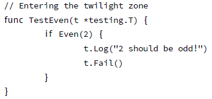

# 包

包是函数和数据的集合。用 package 关键字定义一个包。文件名不需要与包名一致。包名的约定是使用小写字符。Go 包可以由多个文件组成，但是使用相同的 package <name> 这一行。让我们在文件 even.go 中定义一个叫做 even 的包。


名称以大写字母起始的是可导出的，可以在包的外部调用（稍候会对此进行讨论）。

现在只需要构建这个包。在 $GOPATH 下建立一个目录，复制 even.go 到这个目录（参阅第 1 章的“编译和运行代码”）。

```
% mkdir $GOPATH/src/even
% cp even.go $GOPATH/src/even
% go build
% go install
```
现在就可以在程序 myeven.go 中使用这个包：


0 .导入下面的包；  
1. 本地包 even 在这里导入；  
2. 官方 fmt 包导入；  
3. 调用 even 包中的函数。访问一个包中的函数的语法是 <package>.Function()。

```
% go build myeven.go
% ./myeven
Is 5 even? false
```

在 Go 中，当函数的首字母大写的时候，函数会被从包中导出（在包外部可见，或者说公有的），因此函数名是 Even。如果修改 myeven.go 的第 10 行，使用未导出的函数 even.odd：

```
fmt.Printf("Is %d even? %v\n", i, even.odd(i))
```

由于使用了私有的函数，会得到一个编译错误：

```
myeven.go:10: cannot refer to unexported name even.odd
```

概括来说：

- 公有函数的名字以大写字母开头；
- 私有函数的名字以小写字母开头。

这个规则同样适用于定义在包中的其他名字（新类型、全局变量）。注意，“大写” 的含义并不仅限于 US ASCII，它被扩展到了所有大小写字母表（拉丁文、希腊文、斯拉夫文、亚美尼亚文和埃及古文）。

## 标识符

像在其他语言中一样，Go 的命名是很重要的。在某些情况下，它们甚至有语义上的作用：例如，在包外是否可见决定于首字母是不是大写。因此有必要花点时间讨论一下 Go 程序的命名规则。

使用的规则是让众所周知的缩写保持原样，而不是去尝试到底哪里应该大写。Atoi，Getwd，Chmod。

驼峰式对那些有完整单词的会很好：ReadFile，NewWriter，MakeSlice。

### 包名

当包导入（通过 import）时，包名成为了内容的入口。在

```
import "bytes"
```

之后，导入包的可以调用函数 bytes.Buffer。任何使用这个包的人，可以使用同样的名字访问到它的内容，因此这样的包名是好的：短的、简洁的、好记的。根据规则，包名是小写的一个单词；不应当有下划线或混合大小写。保持简洁（由于每个人都可能需要录入这个名字），不要过早考虑命名冲突。

包名是导入的默认名称。可以通过在导入语句指定其他名称来覆盖默认名称：	

```
import bar "bytes"
```

函数 Buffer 现在可以通过 bar.Buffer 来访问。这意味着，包名无需全局唯一；在少有的冲突中，可以给导入的包选择另一个名字在局部使用。在任何时候，冲突都是很少见的，因为导入的文件名会用来做判断，到底是哪个包使用了。

另一个规则是包名就是代码的根目录名；在src/pkg/compress/gzip 的包，作为 compress/gzip 导入，但名字是 gzip，不是 compress_gzip 也不是 compressGzip。

导入包将使用其名字引用到内容上，所以导入的包可以利用这个避免罗嗦。例如，缓冲类型 bufio 包的读取方法，叫做 Reader，而不是 BufReader，因为用户看到的是 bufio.Reader 这个清晰、简洁的名字。更进一步说，由于导入的实例总是它们包名指向的地址，bufio.Reader 不会与 io.Reader 冲突。类似的，ring.Ring（包 container/ring）创建新实例的函数——在 Go 中定义的构造函数——通常叫做 NewRing，但是由于 Ring 是这个包唯一的一个导出的类型，同时，这个包也叫做 ring，所以它可以只称作 New。包的客户看到的是 ring.New。用包的结构帮助你选择更好的名字。

另外一个简短的例子是 once.Do（参看 sync）；once.Do(setup) 读起来很不错，并且命名为 once.DoOrWaitUntilDone(setup) 不会有任何帮助。长的名字不会让其变得容易阅读。如果名字表达了一些复杂并且微妙的内容，更好的办法是编写一些有帮助的注释，而不是将所有信息都放入名字里。

最后，在 Go 中使用混合大小写 MixedCaps 或者 mixedCaps，而不是下划线区分含有多个单词的名字。

## 包的文档

每个包都应该有包注释，在 package 前的一个注释块。对于多文件包，包注释只需要出现在一个文件前，任意一个文件都可以。包注释应当对包进行介绍，并提供相关于包的整体信息。这会出现在 go doc 生成的关于包的页面上，并且相关的细节会一并显示。来自官方 regexp 包的例子：


每个定义（并且导出）的函数应当有一小段文字描述该函数的行为。来自于 fmt 包的例子：

```
// Printf formats according to a format specifier and writes to standard
// output. It returns the number of bytes written and any write error
// encountered.
func Printf(format string, a ...interface) (n int, err error)
```

## 测试包

在 Go 中为包编写单元测试应当是一种习惯。编写测试需要包含 testing 包和程序 gotest。两者都有良好的文档。

go test 程序调用了所有的测试函数。even 包没有定义任何测试函数，执行 go test，这样：


在测试文件中定义一个测试来修复这个。测试文件也在包目录中， 被命名为 *_test.go。这些测试文件同 Go 程序中的其他文件一样， 但是 go test 只会执行测试函数。每个测试函数都有相同的标识，它的名字以 Test 开头：

```
func TestXxx(t *testing.T)
```

编写测试时，需要告诉 go test 测试是失败还是成功。测试成功则直接返回。当测试失败可以用下面的函数标记 [11]。这是非常重要的（参阅 go doc testing 或go help testfunc 了解更多）：

```
func (t *T) Fail()
```

Fail 标记测试函数失败，但仍然继续执行。

```
func (t *T) FailNow()
```

FailNow 标记测试函数失败，并且中断其执行。当前文件中的其余的测试将被跳过，然后执行下一个文件中的测试。

```
func (t *T) Log(args ... i n t e r f a c e { })
```

Log 用默认格式对其参数进行格式化，与 Print() 类似，并且记录文本到错误日志。

```
func (t *T) Fatal(args ... i n t e r f a c e { })
```

Fatal 等价于Log() 后跟随 FailNow()。

将这些凑到一起，就可以编写测试了。首先，选择名字 even_test.go。然后添加下面的内容：


注意在第一行使用了 package even，测试使用与被测试的包使用相同的名字空间。这不仅仅是为了方便，也允许了测试未导出的函数和结构。然后导入 testing 包，并且在第 5 行定义了这个文件中唯一的测试函数。展示的 Go 代码应当没有任何惊异的地方：检查了 Even 函数是否工作正常。现在等待了好久的时刻到了，执行测试：


测试执行并且报告 ok。成功了！

如果重新定义测试函数，就可以看到一个失败的测试：



然后得到：


然后你可以以此行事（修复测试的实例）

>在编写包的时候应当一边写代码，一边写（一些）文档和测试函数。这可以让你的程序更好，并且它展示了你的努力。


## 常用的包

标准的Go 代码库中包含了大量的包，并且在安装 Go 的时候多数会伴随一起安装。浏览 $GOROOT/src/pkg 目录并且查看那些包会非常有启发。无法对每个包就加以解说，不过下面的这些值得讨论：

### fmt

包 fmt 实现了格式化的 I/O 函数，这与 C 的 printf 和 scanf 类似。格式化短语派生于 C 。一些短语（%-序列）这样使用：

%v

默认格式的值。当打印结构时，加号（%+v）会增加字段名；

%#v

Go 样式的值表达；

%T

带有类型的 Go 样式的值表达；

### io

这个包提供了原始的 I/O 操作界面。它主要的任务是对 os 包这样的原始的 I/O 进行封装，增加一些其他相关，使其具有抽象功能用在公共的接口上。

### bufio

这个包实现了缓冲的 I/O。它封装于 io.Reader 和 io.Writer 对象，创建了另一个对象（Reader 和 Writer）在提供缓冲的同时实现了一些文本 I/O 的功能。

### sort

sort 包提供了对数组和用户定义集合的原始的排序功能。

### strconv

strconv 包提供了将字符串转换成基本数据类型，或者从基本数据类型转换为字符串的功能。

### os

os 包提供了与平台无关的操作系统功能接口。其设计是 Unix 形式的。

### sync

sync 包提供了基本的同步原语，例如互斥锁。

### flag

flag 包实现了命令行解析。参阅“命令行参数” 在第 92 页。

### encoding/json

encoding/json 包实现了编码与解码 RFC 4627 [2] 定义的 JSON 对象。

### html/template

数据驱动的模板，用于生成文本输出，例如 HTML。将模板关联到某个数据结构上进行解析。模板内容指向数据结构的元素（通常结
构的字段或者 map 的键）控制解析并且决定某个值会被显示。模板扫描结构以便解析，而“游标” @ 决定了当前位置在结构中的值。

### net/http

net/http 实现了 HTTP 请求、响应和 URL 的解析，并且提供了可扩展的 HTTP 服务和基本的 HTTP 客户端。

### unsafe

unsafe 包包含了 Go 程序中数据类型上所有不安全的操作。通常无须使用这个。

### reflect

reflect 包实现了运行时反射，允许程序通过抽象类型操作对象。通常用于处理静态类型 interface{} 的值，并且通过 Typeof 解析出其动态类型信息，通常会返回一个有接口类型 Type 的对象。

参阅 5，第“自省和反射” 节。

### os/exec

os/exec 包执行外部命令。

##练习

**Q15**. (0) stack 包

1. 参考 Q8 练习。在这个练习中将从那个代码中建立一个独立的包。为 stack 的实现创建一个合适的包，Push、Pop 和 Stack 类型需要被导出。  
2. 为这个包编写一个单元测试，至少测试 Push 后 Pop 的工作情况。  

**Q16**. (2) 计算器

1. 使用 stack 包创建逆波兰计算器。

## 答案

**A15**. (0) stack 包

1. 在创建 stack 包时，仅有一些小细节需要修改。首先，导出的函数应当大写首字母，因此应该是 Stack。包所在的文件被命名为 stack-as-package.go，内容是：


2 .为了让单元测试正常工作，需要做一些准备。下面用一分钟的时间来做这些。

首先是单元测试本身。创建文件 pushpop_test.go，有如下内容：


为了让 go test 能够工作，需要将包所在文件放到 $GOPATH/src：

```
% mkdir $GOPATH/src/stack
% cp pushpop_test.go $GOPATH/src/stack
% cp stack-as-package.go $GOPATH/src/stack
```

输出：


**A16**. (2) 计算器

1. 这是第一个答案：


